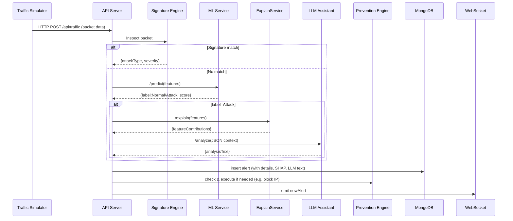
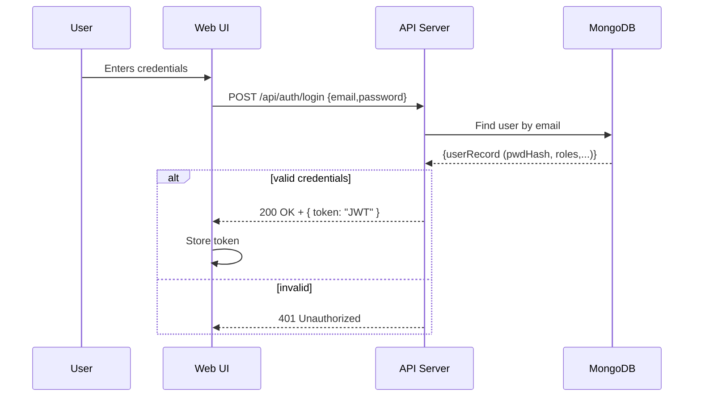
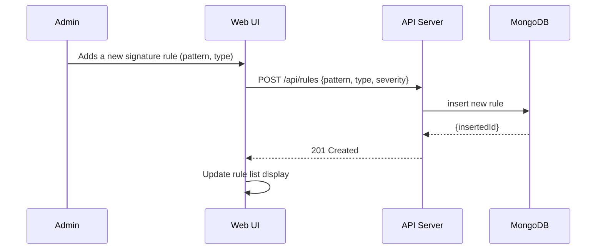
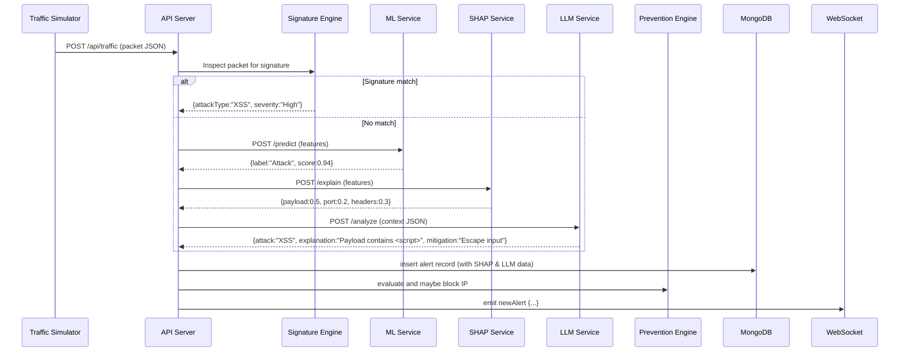
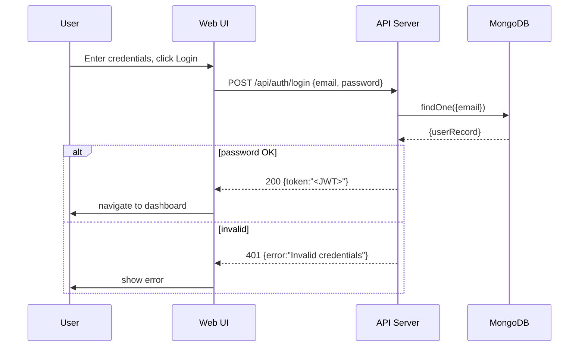
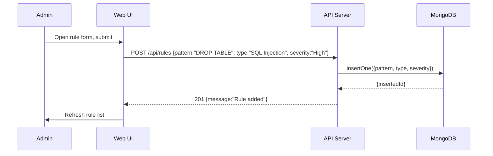

# Executive Summary

suraksha is envisioned as an enterprise-grade hybrid Intrusion Detection and Prevention System (IDPS) that continuously monitors simulated network traffic, detects both known and unknown attacks, explains alerts, and visualizes them on a real-time Security Operations Center (SOC) dashboard. The platform combines **signature-based detection** (à la Snort) with **machine-learning anomaly detection** and *explainable AI* (SHAP and a Large Language Model) to provide rich context for each alert. suraksha can also simulate automated prevention actions (e.g. IP blocking) and generate historical security reports. 

The architecture is designed as a **decoupled microservices system** with a React/Tailwind frontend and a backend composed of multiple services (API server, ML service, etc.). Real-time data flows use WebSockets, while REST APIs (Node.js/Express and Python/FastAPI) handle configuration, historical queries, and inter-service communication. MongoDB serves as the primary data store for logs, alerts, and configurations. We follow industry best practices (e.g. OWASP guidance for security), ensuring a robust design. The system is containerized and can be deployed via Docker Compose or Kubernetes. Monitoring and CI/CD pipelines are also addressed to support development and maintenance.

This architecture document is intended to guide developers and ML engineers. It includes: context and container diagrams; component designs for each major service; sequence diagrams for key workflows; data models and MongoDB schemas; API endpoint specifications; folder structure; communication patterns; WebSocket design; ML pipeline details; SHAP integration; LLM prompt design; threat scoring logic; prevention actions; security and deployment strategies; CI/CD suggestions; monitoring and scaling; and an appendix with additional diagrams and a service/environment matrix.

## System Context (C4)

At the highest level, **suraksha** interacts with *two primary user roles* and some external data sources (e.g. a traffic simulator or Snort logs).  

- **Security Administrator / Analyst:** Uses the web dashboard to monitor alerts, investigate incidents, and manage rules.  
- **Network Infrastructure (Simulator or Snort):** Feeds network traffic or IDS alerts into suraksha for analysis. In simulation mode, a built-in Traffic Simulator generates synthetic HTTP/network traffic. Optionally, Snort or another IDS can be used to feed real alerts into the system (e.g. via a log export or TCP stream).

The following context diagram illustrates these relationships:

```mermaid
C4Context
  Person(admin, "Security Admin", "Monitors network security via the dashboard")
  System_Boundary(suraksha, "suraksha System")
  System(Frontend, "Web Dashboard", "React SPA with real-time charts")
  System(APIGateway, "API Server", "Node.js/Express backend handling all API calls")
  System(MLService, "ML Anomaly Service", "Python/FastAPI for anomaly detection")
  SystemExt(TrafficSim, "Traffic Simulator", "Generates or captures network requests")
  SystemExt(Snort, "Snort IDS (optional)", "External IDS producing alerts")
  
  Person(admin) --> Frontend: "Uses web interface"
  TrafficSim --> APIGateway: "Sends traffic records"
  Snort --> APIGateway: "Sends IDS alert logs"
  Frontend --> APIGateway: "Calls REST APIs & listens on WebSocket"
  APIGateway --> MLService: "Forwards data for analysis"
  APIGateway --> Frontend: "Pushes real-time alerts"
```

The **enterprise boundary** encloses the suraksha system (dashboard, backend services, DB). Outside it are: (a) the *simulated network traffic generator*, (b) *Snort or other IDS* (if used), and (c) the *admin user*. The admin is the only human actor that directly interfaces; all other elements are machines/services. 

## Container Diagram

Within the suraksha system, we define the following containers (major deployed components):

```mermaid
C4Container
  Container(Frontend, "Web Dashboard", "React + Tailwind CSS + Socket.IO", "Provides user interface and real-time data visualization (charts, tables).")
  Container(API, "API Server", "Node.js + Express", "Main backend API and orchestration hub for processing traffic, alerts, and queries.")
  Container(DB, "MongoDB", "MongoDB", "NoSQL database storing traffic logs, alerts, rules, users, etc.")
  Container(DetectionEngine, "Signature Engine", "JavaScript (Node) module or Snort integration", "Scans packets against known attack signatures.")
  Container(MLService, "Anomaly Detection Service", "Python + FastAPI", "Applies ML models (e.g. Random Forest) to detect unusual traffic patterns.")
  Container(ExplainService, "Explainability Service", "Python + FastAPI", "Computes SHAP values for ML decisions; exposes explainable results.")
  Container(LLMService, "LLM Assistant", "Python + FastAPI (OpenAI GPT)", "Generates human-readable explanations and remediation advice via large language model.")
  Container(PreventionEngine, "Prevention Engine", "Node.js", "Executes simulated prevention actions (IP blocking, rate limiting, notifications).")
  Container(NotificationService, "Notification Service", "Node.js", "Sends emails or messages for critical alerts (optional).")
  Container(AnalyticsService, "Analytics Service", "Node.js", "Aggregates data, produces reports (e.g. daily/weekly PDFs, charts).")
  System_Ext(TrafficSim, "Traffic Simulator", "Custom Script", "Generates synthetic network requests for testing.")
  System_Ext(Snort, "Snort IDS", "C/C++ NIDS", "Optionally integrated to feed existing IDS alerts.")
  Person(admin, "Security Admin", "Logs into dashboard to view alerts and manage rules.")
  
  Person(admin) --> Frontend: "Uses"
  TrafficSim --> API: "HTTP traffic"
  Snort --> API: "Alerts via logs or API"
  Frontend --> API: "REST API calls & WS subscriptions"
  API --> DetectionEngine: "Invoke packet inspections"
  API --> MLService: "POST traffic features"
  API --> ExplainService: "POST for SHAP values"
  API --> LLMService: "POST for natural language analysis"
  API --> PreventionEngine: "Trigger actions (block IP)"
  API --> DB: "Read/Write data"
  API --> AnalyticsService: "Generate summary reports"
  NotificationService --> Admin: "Email/SMS alerts"
```

**Container roles and responsibilities:** 

- **Web Dashboard (Frontend):** Single-page React application (with Tailwind CSS styling and Recharts for charts). It connects to the backend via REST and WebSockets (Socket.IO) to display live traffic, alerts, charts, and forms (see Design section). It authenticates using JWT tokens.

- **API Server (Node.js/Express):** The system’s core. All client requests (from frontend or external inputs) come here. It parses data, calls appropriate subsystems, and returns results. It also manages WebSocket connections to push real-time updates. It includes sub-modules: 
  - *Traffic Ingestion/Preprocessing:* accepts new packets (e.g. `POST /api/traffic`), extracts features, and routes to detection engines. 
  - *Signature Engine Integration:* either via a custom Node.js module or invoking Snort externally. This matches packets to known attack signatures.
  - *Rule Manager:* CRUD for user-defined detection rules (custom signatures).
  - *Alert Router:* collates results from detection services, computes threat scores, and triggers alerts.
  - *Authentication & Security:* JWT-based login, RBAC checks (per OWASP least privilege), input validation.
  - *Logging/Monitoring:* logs requests, errors, and metrics to files or a logging pipeline.
  
- **MongoDB (Database):** Stores collections for Users, Sessions, TrafficLogs, Alerts, Rules, BlockedIPs, Reports, etc. Indexes on timestamp, IP, and TTL for old data. See *Data Model* below.

- **Detection Engine (Signature):** Implements pattern-matching signatures. Could embed Snort’s detection library or replicate key Snort functions (packet decoder, preprocessing, rule engine). It inspects each packet/payload for known attack patterns (SQLi, XSS, etc.), and if matched, immediately raises an alert.

- **Anomaly Detection Service (MLService):** A Python FastAPI microservice that loads a trained ML model (e.g. Random Forest or XGBoost) for anomaly detection. It receives JSON features from the API (`/api/analyze`) and returns a classification (`Normal` or one of [DoS, Probe, R2L, U2R] etc.) with a confidence score. It is designed to be stateless and horizontally scalable. We ensure low-latency responses (target <50ms) by keeping the model loaded in memory and using FastAPI’s async features.

- **Explainability Service (ExplainService):** Also a FastAPI Python service, possibly part of the ML service or separate. When the MLService flags an anomaly, the API calls ExplainService to compute SHAP values for that event. SHAP identifies which features contributed most to the decision (e.g. “Large packet size” or “Port 22 access”). The JSON of feature importances is returned and stored with the alert. These values are displayed to the user to explain “why” the AI flagged the traffic.

- **LLM Assistant (LLMService):** A Python microservice that uses a Large Language Model (e.g. OpenAI GPT-4 or Azure/Gemini) to generate human-readable analysis. It receives structured input (cleaned JSON of the alert, features, or system context) and returns a text explanation and recommended mitigation steps. Prompts are carefully engineered to instruct the model to “be a security analyst”. This service helps convert technical alerts into plain language for the analyst. Only high-severity or ambiguous alerts are sent to the LLM to save tokens (the tiered approach from ).

- **Prevention Engine:** A Node.js module that takes alerts and decides on automatic actions. For example: after *n* consecutive failed logins from an IP, add it to the blocklist (simulated); or if severity is `CRITICAL`, trigger an IP block for 10 minutes. It runs background tasks or uses a rule-based engine (“playbook”) to match conditions and fire actions. Actions are recorded in DB, and once an IP is “blocked”, the API refuses traffic from it (simulated drop). This demonstrates Intrusion Prevention behavior.

- **Analytics Service:** Generates aggregated views and reports (e.g. attack trends per day, types distribution). Exposes REST endpoints for the frontend to fetch summary statistics. Optionally, it can produce PDF/CSV export of reports. It might use MongoDB aggregation pipelines or an external analytics engine.

- **Notification Service (optional):** Upon critical alerts, this service can send emails or push notifications to administrators. It listens to alert events (e.g. via message queue or direct function call) and sends formatted alerts with relevant info.

Together, these containers handle the end-to-end workflow: traffic → detection → analysis → alert/store → visualization → optional prevention/actions.

## Component Design

Below we outline key internal components for each major service. These are not all drawn as diagrams, but we describe their elements.

- **Web Dashboard (Frontend):** Composed of React components (e.g. `<Login/>`, `<LiveTrafficTable/>`, `<Charts/>`, `<AlertList/>`, `<RuleManager/>`). It uses React Router for pages, Context/Redux for state, and Socket.IO client for live updates. Charts use Recharts to plot time series and distributions. The UI follows a responsive Tailwind CSS design, with a dark theme (common in SOC UIs). It handles JWT storage in memory or local storage, attaches it to each API request, and automatically reconnects to the WebSocket with the token.

- **API Server (Backend):** Follows a MVC/Service pattern. Routes (Express) call controller functions which use various services. Key sub-modules:
  - *AuthService:* Handles login/signup (verifies credentials, issues JWT).
  - *UserService:* Manages user accounts and roles.
  - *TrafficService:* Accepts new traffic events (`POST /api/traffic`), preprocesses to feature vector, and forwards to DetectionService.
  - *DetectionService:* Invokes SignatureEngine and MLService, aggregates results.
  - *RuleService:* CRUD for custom signature rules stored in DB.
  - *AlertService:* Creates alert records, computes threat score, triggers websocket emit and push to DB.
  - *ExplainService:* Sends requests to Explainability microservice, stores responses.
  - *LLMIntegration:* Calls LLMService with contextual prompts when needed.
  - *PreventionService:* Contains logic for blocking rules (e.g. threshold counters) and executes actions.
  - *AnalyticsService:* Provides endpoints like `GET /api/analytics?range=week` that query the DB for counts/trends.
  - *WebSocketManager:* (Using Socket.IO) handles client subscriptions. On login, a WS connection is established. The server emits events like `newAlert`, `updateStats` to clients. It verifies JWT on each socket connection and can place clients in “rooms” (e.g. per user or for broadcasting to all admins).
  - *Middlewares:* Input validation (Joi or express-validator), error handling, rate limiting (to prevent DoS), CORS config, Helmet (secure headers).

- **Signature Engine:** Could be implemented as a Node module or external binary. If using Snort rules, this module would parse packet payloads and match against regex patterns. Snort’s architecture (decoder, preprocessors, detection engine, output modules) can guide a simplified version. On match, it returns the rule name and metadata. The engine can be run inline in Node or as a subprocess.

- **ML/Explainable Service:** The MLService and ExplainService could be combined or separate. Essential components:
  - *FeatureExtractor:* Converts incoming traffic JSON into a fixed feature vector. (E.g., encode HTTP method, payload length, header counts, country of IP via GeoIP, time features.) Similar to how the research paper uses features like hour_of_day, packet_size.
  - *Model:* A trained anomaly detection model (Isolation Forest, RF, or XGBoost). Stored as a pickle/joblib file. Loaded at startup.
  - *Prediction Endpoint (`/predict`):* Receives features, outputs `{label:Normal/Attack, score:0-1, modelUsed:"RF"}`.
  - *SHAP Integration:* After a prediction of “Attack”, compute SHAP values (`shap.TreeExplainer(model).shap_values(X)`) and return top contributors.
  - *Logging:* Each inference and result is logged for auditing.

- **LLM Assistant:** Key parts:
  - *Prompt Templates:* E.g. `"System: You are a cybersecurity analyst. Given this traffic log: {{payload}}. Identify the attack type and suggest fixes."`
  - *API Integration:* Calls OpenAI or other LLM API with messages. Rate-limit usage per account and throttle to avoid runaway costs.
  - *Content Safety:* Sanitize inputs to avoid injection; use OpenAI’s moderation endpoint. Enforce no outbound connections. Follow OWASP RAG guidelines when using AI content.
  - *Response Formatting:* Request the model to output JSON or Markdown (attackName, explanation, recommendations) to easily parse.

- **Prevention Engine:** Implements rules like:
  - If an IP triggers >5 failed logins within 1 minute → block for 10 minutes.
  - If an event severity is CRITICAL → immediately block its IP (or port).
  - Actions: add IP to `BlockedIPs` collection, with TTL index so block expires automatically. This DB is checked by API middleware to drop requests. Optionally, use `setTimeout` or scheduled job to remove expired blocks.
  - Also manages notifications (e.g. emit `blocked` event to frontend, or call NotificationService).

- **Notification Service:** (If implemented) contains SMTP/SMTP2Go/etc. credentials in env. Listens for alert events and sends templated emails to admin users. This can be part of API Server or a separate Node service.

- **Analytics Service:** Aggregates logs to pre-compute metrics (e.g. counts per day, top alert types). Could run periodic jobs or on-demand queries. Returns JSON for frontend charts.

- **Database (MongoDB):** The DB container stores all data. We’ll detail collections next.

## Sequence Diagrams for Key Flows

### 1. Traffic Ingestion → Detection → Explainability → Alert/Prevention



1. **Traffic arrives** at the API (`/api/traffic`). The API parses it and passes raw data to the **Signature Engine**.  
2. If a **known attack signature** matches, an immediate alert is generated. Otherwise, the API sends features to the **ML Service** for analysis.  
3. If ML labels it as normal, nothing further happens. If it is **anomalous**, the API calls the **SHAP ExplainService** to get feature importances, and calls the **LLM Assistant** to get a natural-language breakdown.  
4. The API logs the alert (including SHAP values and LLM text) into MongoDB, computes a threat score, and notifies the PreventionEngine to possibly act (e.g. block IP).  
5. The API pushes a `newAlert` event over WebSocket to any connected dashboard clients. The frontend then displays the alert with all context.

This flow covers *Units II–III–IV*: it uses signature analysis, ML anomaly detection, explainability, and prevention.

### 2. User Login Flow



The user submits login credentials. The API validates them against the `Users` collection. On success, it returns a JWT token, which the frontend stores (e.g. in memory). The token is then sent in the `Authorization` header (Bearer) on all subsequent requests. Socket.IO connection also includes the token for auth.

### 3. Custom Rule Update



Admins can create or update signature rules. These rules are stored in the `Rules` collection and immediately used by the signature engine on new traffic.

## Data Model and MongoDB Schemas

We use MongoDB (NoSQL) to flexibly store various data types. Here are the primary collections:

| Collection       | Sample Fields                                                                                                       | Indexes / TTL                           |
|------------------|---------------------------------------------------------------------------------------------------------------------|-----------------------------------------|
| **users**        | `_id (ObjectId), name (string), email (string, unique), passwordHash, roles ([“admin”,”analyst”]), createdAt, updatedAt` | Index on `email` (unique).             |
| **sessions**     | `_id, userId, token, validUntil` (optional, for session revocation)                                                 | TTL on `validUntil` for expiring tokens. |
| **trafficLogs**  | `_id, timestamp, srcIP, destIP, protocol, port, method, url, payload (string), packetSize, headers (dict), userAgent` | Index on `timestamp`, `srcIP`. TTL (e.g. 30 days). |
| **alerts**       | `_id, timestamp, trafficId (ref), ip, type (string), severity (Low/Med/High/Critical), score (0-100), description, shapValues (object), llmText (string), handled (bool)` | Index on `timestamp`, `ip`, `severity`. TTL (e.g. 90 days). |
| **rules**        | `_id, pattern (string or regex), attackType (string), severity (Low/Med/High/Critical), description, createdAt`      | Index on `pattern`.                     |
| **blockedIPs**   | `_id, ip (string), reason (string), blockedAt (timestamp), expiresAt (timestamp)`                                   | TTL on `expiresAt`.                     |
| **reports**      | `_id, type (string), periodStart, periodEnd, generatedAt, summary (object), pdfLink (string) ...`                    | Index on `generatedAt`.                |
| **settings**     | `_id, key, value` (for global config like threshold values, etc.)                                                   | -                                       |

- **Indexes:** We index on fields commonly queried: `timestamp` for time-range queries, `srcIP` or `ip` for filtering by IP, and `severity` for stats.  
- **TTL:** Old logs and alerts age out. E.g. `trafficLogs` might expire after 30 days; `alerts` after 90 days. `sessions` and `blockedIPs` have TTL fields to auto-delete expired tokens or un-block IPs.  
- **Relationships:** We usually store references by ID (e.g. `alerts.trafficId` → `trafficLogs._id`). Joins are done in code or via aggregations if needed.  
- **Collections use snake_case or camelCase?** We use lowerCamelCase in code (as shown).  

## API Contract Examples

All API routes require a JWT (except `/auth/login`). Responses are JSON. Below are key endpoints:

| Method | Endpoint             | Description                          | Request Body                          | Response                           |
|--------|----------------------|--------------------------------------|---------------------------------------|------------------------------------|
| POST   | `/api/auth/login`    | Authenticate user, return JWT        | `{ "email":string, "password":string }` | `200 OK { "token": string }` or `401` |
| GET    | `/api/users/me`      | Get current user info                | (header: Authorization)               | `200 { id,name,email,roles,... }`   |
| GET    | `/api/traffic`       | List recent traffic (with filters)   | Query params: `ip=`, `from=`, `to=`   | `200 [{trafficLog}, ...]`          |
| POST   | `/api/traffic`       | Ingest a new traffic event           | `{ timestamp, srcIP, destIP, port, protocol, payload, ... }` | `201 Created`                     |
| GET    | `/api/alerts`        | List alerts (filter by severity, date, handled) | Query: `severity=`, `dateFrom=`, `unhandledOnly=true` | `200 [{alert}, ...]`          |
| GET    | `/api/alerts/{id}`   | Get details of one alert             | —                                     | `200 {alert details (with SHAP, LLM text)}` |
| POST   | `/api/rules`         | Create a new detection rule          | `{ "pattern":string, "attackType":string, "severity":string }` | `201 Created`                     |
| GET    | `/api/rules`         | List all custom rules                | —                                     | `200 [{rule}, ...]`                |
| PATCH  | `/api/rules/{id}`    | Update a rule                        | `{ "pattern":..., ... }`              | `200 {updated rule}`               |
| DELETE | `/api/rules/{id}`    | Delete a rule                        | —                                     | `204 No Content`                   |
| GET    | `/api/blocked`       | List currently blocked IPs           | —                                     | `200 [{ ip, expiresAt, reason }, ...]` |
| GET    | `/api/analytics`     | Get summary statistics (counts/trends) | Query: e.g. `period=week` or `from=...&to=...` | `200 { totalAlerts:123, byType:{...}, chartData:... }` |
| GET    | `/api/reports/daily` | Generate/download daily report (optional) | Query: `date=YYYY-MM-DD`           | `200 { reportLink:"..." }` or PDF |

**Example Request/Response (Alerts):**

```http
GET /api/alerts?severity=High&unhandledOnly=true
Authorization: Bearer <token>
```
```json
[
  {
    "_id": "615f1a2b3c4d5e6f7a8b9c0d",
    "timestamp": "2026-08-01T14:23:05Z",
    "srcIP": "203.0.113.45",
    "attackType": "SQL Injection",
    "severity": "High",
    "score": 92,
    "description": "Detected 'UNION SELECT' in payload",
    "shapValues": {
      "payload_SQL_terms": 0.45,
      "url_length": 0.30,
      "query_params": 0.15
    },
    "llmText": "Alert: SQL Injection attempt detected. ... (truncated)"
  },
  ...
]
```

All requests expecting JSON should set `Content-Type: application/json`. Error responses use standard HTTP codes (400,401,404,500) with a JSON message. The WebSocket endpoint uses `Authorization` at handshake.

## Repository / Folder Structure

We organize the code in a monorepo format, for clarity and consistency:

```
/apps
  /frontend            # React app
    /src
      /components
      /pages
      /services        # API client, auth
      /contexts
      /assets
    package.json
  /backend             # Main Node.js API server
    /controllers
    /models            # (for reference, if using ORMs or schemas)
    /routes
    /services         # business logic (DetectionService, AuthService, etc.)
    /middleware
    /utils
    server.js
    package.json
  /ml-service          # Python ML + Explainability services
    app.py (FastAPI entry)
    model.pkl
    /src
      ml_model.py
      shap_explainer.py
      data_preprocess.py
    requirements.txt
  /llm-service         # Python LLM wrapper (or merged with ml-service)
    app.py (FastAPI for LLM calls)
    requirements.txt
  /notification-service # (Optional) Node or Python microservice
    index.js
    package.json
  /analytics-service   # (Optional) Node service for heavy analytics
    app.js
    package.json

/shared                 # Shared code (utilities, types) for all services (e.g. JSON schemas, constants)
/configs                # Configuration files (e.g. Docker Compose, ESLint, Prettier, etc.)
/docker                 # Dockerfiles or Compose files
  docker-compose.yml
  Dockerfile.backend
  Dockerfile.frontend
  Dockerfile.ml
.gitignore
README.md
```

- **apps/frontend:** The React source. Built artifacts go into a Docker container or a `build/` folder.  
- **apps/backend:** The Express API code. Routes are defined in `routes/`, services in `services/`.  
- **apps/ml-service:** The Python ML and explain API (FastAPI).  
- **apps/llm-service:** The Python LLM API (also FastAPI) – could merge with ml-service if desired.  
- **apps/notification-service, analytics-service:** Optional microservices in Node/Python.  
- **shared:** Common code or definitions, e.g. code to generate JWT tokens, common constants (threat levels, etc.), type definitions for TypeScript.  
- **configs/docker:** Docker Compose and Dockerfiles to containerize each component.  
- **scripts:** (optional) scripts for data generation, retraining ML models, DB migrations, etc.

Each service has its own `package.json` or `requirements.txt` and can be started independently. We use environment variables (via `.env` files or Docker secrets) for configuration (DB URIs, API keys, secrets).

## Inter-Service Communication

- **Frontend ↔ API:** The web UI communicates with the API server over HTTPS (REST) and with the WebSocket server (Socket.IO) on the same domain (e.g. via `wss://server/`).  
- **API ↔ MLService/ExplainService/LLMService:** HTTP/JSON REST calls. The API Server makes POST requests to these services (e.g. `http://ml-service:8001/predict`). We could also use gRPC or a message queue (e.g. RabbitMQ) for higher throughput, but for simplicity we use REST over the internal Docker network. Each service runs on a separate port (e.g. 8001 for ML, 8002 for LLM). We secure these calls with internal tokens or network policies.  
- **API ↔ Database:** The API server connects to MongoDB using the official MongoDB driver. Each microservice could also connect to Mongo if needed (e.g. ml-service for logging), but we restrict DB writes primarily to the API server to centralize control.  
- **Pub/Sub for Notifications:** To decouple alert production from notifications, we may integrate a lightweight message broker (e.g. Redis pub/sub, or simply trigger via code). For example, the API server publishes an event (`alertCreated`) that NotificationService subscribes to for emailing. This prevents API blocking on email sending.  
- **WebSockets:** We use Socket.IO on both client and server. It supports rooms (for broadcasting). We plan to have one room per admin user session (authenticated via JWT). When an alert is generated, `io.to(adminUserId).emit('newAlert', alertData)`. The client reconnects automatically on network glitches. We enforce WS origin checks and re-auth on reconnect. 

## WebSocket Design

- **Connection:** Admins open a Socket.IO connection to `wss://suraksha.example.com/ws`. The JWT token is sent as a query param or via an `authenticate` event. The server verifies the token immediately.  
- **Rooms:** We could simply emit globally since typically there is only one admin viewing the UI. For multi-tenant extension, clients join a room named by their userId or organization.  
- **Events:** Key events include `newAlert` (carries alert JSON), `updateStats` (e.g. updated counts), and `ruleChanged` (to refresh rule lists). The frontend listens and updates state.  
- **Resilience:** Use the built-in reconnection logic of Socket.IO. Heartbeats (ping/pong) keep the connection alive. If the token expires, the client must re-login.  
- **Security:** We ensure WS is only enabled on TLS (`wss`), and only after HTTP auth. Use CORS/CSRF protections as needed (though socket.io is separate from browsers’ CSRF). OWASP emphasizes protecting real-time channels as well.

## ML Pipeline

We train our anomaly detection model offline using a public dataset, then integrate it for real-time inference.

- **Datasets:** Use well-known IDS datasets such as NSL-KDD, CICIDS2017, or UNSW-NB15. These provide examples of normal and attack traffic. We preprocess them into our feature schema.  
- **Features:** Likely features include packet size, frequency of requests from an IP, number of failed logins, protocol, destination port, time-of-day (cyclic encoding), geographic attributes, etc. The research architecture used features like hour_of_day, packet_size, etc.. We combine packet-level and session-level features.  
- **Preprocessing:** Clean data, encode categorical fields (one-hot), scale numeric fields. Remove PII (IP addresses may be hashed or replaced with ASN). For training, we split into train/test sets (e.g. 80/20).  
- **Model:** We recommend starting with tree-based methods (e.g. Random Forest, XGBoost) due to their interpretability and speed. For anomaly detection, an Isolation Forest is a good unsupervised choice. The model is serialized (pickle) and loaded by FastAPI on startup.  
- **Training/Validation:** Use cross-validation to tune hyperparameters. Track metrics (accuracy, F1, false positive rate) on a validation set. The research paper reports F1 = 0.93 for their model. We can cite that as a benchmark.  
- **Model Serving:** The MLService exposes endpoints like `/predict`. We aim for low latency (<50ms per request) to support high throughput (the prototype handled >10k events/sec with FastAPI). The model can be warmed up and stays in RAM. If traffic spikes, multiple instances of MLService can be run behind a load balancer.  
- **Retraining:** Periodically retrain the model with new data (e.g. weekly). We might include a job that fetches the latest logs and triggers retraining. This can be automated (cron) and the new model hot-swapped.  
- **Performance Targets:** According to experimentation, an async FastAPI backend can sustain 10,000 events/sec. We aim to match that or better. We benchmark the MLService in isolation (using torch or Tensorflow if neural nets are used, but RF should be faster).

## SHAP Integration

After the ML service flags an event as anomalous, the ExplainService computes **SHAP values** to explain the decision.

- **Computation:** Use the SHAP library. For tree models, `TreeExplainer` is fast. We compute SHAP for the top K features. Since this can be CPU-intensive, we may limit SHAP calls to the top-`N` suspicious events or use a smaller subset of features.  
- **Storing:** The API will store the returned SHAP values in the `alerts` collection (e.g. `alert.shapValues = {...}`). We include feature name → contribution.  
- **Visualization:** The frontend will display these as a list or bar chart highlighting which features pushed the prediction. For example: `packetSize +0.32, freq +0.21, port 22 +0.15`. This demystifies the ML model.  
- **Caching (Optional):** If multiple analysts request explanations for the same alert, we can cache SHAP results in Mongo or Redis. We can also pre-compute SHAP for known attack patterns.

## LLM Prompt Design and Safety

The LLM Assistant is a powerful addition that must be carefully controlled.

- **Prompt Templates:** We craft system messages such as: *“You are a cybersecurity analyst. Given the following log of network activity, identify the likely attack type and suggest mitigation steps. Output in concise bullet points.”* The log details (JSON) are inserted. We also instruct the model on format (e.g. JSON or markdown).  
- **Sample Prompt:**  
  ```
  System: You are a senior security analyst.
  User: Logs: {"payload":"...<script>alert(1)</script>...","srcIP":"...","url":"/search?q=<script>"}.
  Analyze the log, identify the threat, explain it briefly, and recommend mitigation. 
  Respond with structured JSON {"attackType":..., "explanation":..., "remediation":...}.
  ```  
- **Safety Guardrails:** We sanitize the log data (escape any markup) to prevent prompt injection. Use functions that ensure the log is inserted as a string literal. We also set instruction boundaries in the prompt. We may run the LLM output through a moderation API to catch disallowed content (though in a controlled corporate setting, this risk is low).  
- **Usage:** Not every alert goes to the LLM—only those with certain tags or severity (e.g. “SQL Injection” triggers an analysis). This hybrid approach reduces token usage (supported by research). The responses are parsed as JSON by the API and shown on the dashboard under an “Explanation” section.  

## Threat Scoring Algorithm

Each alert gets a **Threat Score** (0–100) to prioritize handling. We incorporate multiple factors:

1. **Base Severity:** We map known attack types to a CVSS-like score. For example, using FIRST.org CVSS v3.1 guidelines:
   - Critical (9.0–10.0) → score ≈ 95–100  
   - High (7.0–8.9) → ≈ 70–90  
   - Medium (4.0–6.9) → ≈ 40–69  
   - Low (<4.0) → ≈ 10–39  

2. **Confidence Score:** From the ML model (0–100%), scaled linearly. A high-confidence anomaly raises the score. Signature alerts default to 100% confidence.

3. **Historical Frequency:** If the same IP or attack type has appeared repeatedly, we boost the score (attacks in waves become higher priority).

4. **CVE/CVSS Mapping:** If the alert matches a known CVE (e.g. payload contains exploit for CVE-2024-XXXX), we lookup its CVSS Base score from NVD and incorporate it. For example:
   ```
   threatScore = w1*severityScore + w2*mlConfidence + w3*cveScore + w4*(1 / (timeSinceFirstSeen))
   ```
   where w1–w4 are tuned weights (e.g. 40%,30%,20%,10%).  

5. **Custom Weights:** Admin can adjust weights via settings (`settings.threatWeights`).

The resulting score is displayed in the dashboard (e.g. “84/100 Critical”) and used to color-code alerts. This quantifies risk, helping analysts focus on the riskiest incidents first.

## Prevention Actions (Simulation)

For educational/safety reasons, we *simulate* prevention actions rather than enforce real firewall rules. Key actions:

- **Block IP:** When an IP is added to `blockedIPs`, the API checks this list on each request and rejects matching traffic (responds with 403) automatically. The admin sees the IP flagged in the dashboard. A TTL (`expiresAt`) field ensures it unblocks after a period (e.g. 30 minutes) or can be manually unblocked.

- **Rate Limiting:** We can record request counts per IP and throttle if it exceeds a threshold. (E.g. if >100 requests/min, delay responses or drop some.)

- **Log out User:** If an internal user shows signs of compromise (like multiple password attempts), we can force-logout their session (delete tokens from `sessions` collection).

- **Alerts:** For each prevention, the admin gets a real-time notification (e.g. “IP 203.0.113.1 has been blocked for 10 minutes”).

- **Playbook Triggers:** The PreventionEngine (Playbook Manager) runs continuously, checking conditions like “if >3 critical alerts from same IP within 5 min, then block IP”. These rules are configurable via the UI (Settings page).

The key is that prevention *actions are clearly logged* and reversible, to demonstrate IPS behavior without impacting any real network.

## Security Architecture

We apply multiple layers of security and validation throughout the stack:

- **Authentication (JWT):** All API requests require a valid JSON Web Token. Tokens are signed with a strong secret (or RSA keys) and short-lived (e.g. 1h). We verify the JWT on each request (Express middleware) and on WebSocket connections.

- **Authorization (RBAC):** Users have roles (e.g. `admin` vs `analyst`). We enforce **least privilege**: admin can manage rules and users, analysts can only view alerts. Middleware checks user roles on each protected route. We deny by default and explicitly allow needed actions.  

- **Input Validation and Sanitization:** All incoming data is validated against schemas (e.g. using Joi or express-validator). We use a strict allowlist approach: only expected fields and types are accepted. For example, rule patterns are validated as safe regex strings; incoming JSON is parsed with protection against injection. OWASP recommends always validating input server-side. We also validate paths, parameters, and body payloads to avoid injection attacks (SQL/NoSQL injection, shell injection).  

- **Output Encoding:** Any data rendered in the UI is automatically escaped to prevent XSS (React does this by default). However, we will sanitize any free-form content (like LLM output) to strip HTML tags. We also use a Content Security Policy (CSP) header in the HTTP response to restrict scripts.  

- **Session Security:** Use secure, HTTP-only cookies (if we used cookies) or localStorage in the browser for JWTs. The API sets CORS rules to allow only our frontend origin.

- **Rate Limiting:** We add a rate limiter (e.g. 100 req/min/IP) on login and traffic endpoints to mitigate brute force or flooding. This can use libraries like `express-rate-limit`. We also throttle WebSocket messages if a client misbehaves.

- **HTTPS Everywhere:** All services must run over TLS in production. Secrets (database URIs, JWT secret, API keys) are stored in environment variables or a secrets manager, never in code.

- **Dependency Management:** We pin all dependencies (via `package-lock.json` and `requirements.txt`) and regularly update them. We use tools like OWASP Dependency-Check or `npm audit` to find vulnerabilities.

- **NoSQL Security:** For MongoDB, avoid operator injection by strict schemas and using the official driver with parameterized queries. Use built-in MongoDB auth and access control (create a database user with minimal permissions for the API).

- **Network Security:** In production, we’d isolate services via a VPC or Docker network. API and DB ports are not exposed publicly; only the Node API port (e.g. 443) is open. We could use a reverse proxy (nginx) in front for TLS termination and additional filtering.

- **Logging Sensitive Data:** We avoid logging sensitive user data (passwords, tokens). We log general events (login success/fail, API errors) and possibly alert metadata, but never raw passwords or payloads containing private info.

- **Other OWASP Measures:** We set secure HTTP headers via helmet (HSTS, XSS protection, etc.), implement JSON Web Token best practices (short life, use refresh token if needed), and follow OWASP “Proactive Controls” and Input Validation guidelines.

By layering these measures, we protect suraksha itself from common threats (injection, CSRF, XSS, insecure authentication) while it protects the simulated network from attacks.

## Deployment Architecture

We will containerize each component for portability and scalability. A typical Docker Compose setup looks like:

- **Frontend:** runs on `nginx:stable-alpine` serving the static React build, port 80 (mapped to host 3000 or 443).  
- **Backend API:** runs on `node:18-alpine`, listening on port 5000 (mapped to host port 8000).  
- **ML Service:** runs on `python:3.11-slim`, port 8001.  
- **LLM Service:** similar container on port 8002.  
- **MongoDB:** `mongo:6.0`, default port 27017 (no public port; accessible only to API via Docker network).  
- **Optional Redis:** for session caching or pub/sub (port 6379).  
- **Optional Nginx:** as a reverse proxy with SSL (port 443) that forwards `/api` to Node, `/ml` to ML, etc. Or use a cloud load balancer.  

These services are defined in `docker-compose.yml`, e.g.:

```yaml
version: '3.8'
services:
  frontend:
    build: ./apps/frontend
    ports: ["3000:80"]
    environment:
      - REACT_APP_API_URL=https://suraksha.local/api
  api:
    build: ./apps/backend
    ports: ["8000:5000"]
    depends_on: ["db", "ml-service", "llm-service"]
    environment:
      - MONGO_URI=mongodb://db:27017/suraksha
      - JWT_SECRET=...
  ml-service:
    build: ./apps/ml-service
    ports: ["8001:8001"]
    depends_on: ["db"]
    environment:
      - MODEL_PATH=/app/model.pkl
  llm-service:
    build: ./apps/llm-service
    ports: ["8002:8002"]
    environment:
      - OPENAI_API_KEY=...
  db:
    image: mongo:6.0
    volumes: ["dbdata:/data/db"]
    environment:
      - MONGO_INITDB_DATABASE=suraksha
  websocket:
    image: node:18-alpine   # Could be part of api
    # not separate if socket is in api server
volumes:
  dbdata:
```

**Kubernetes (Optional):** For production scaling, one could deploy to K8s with the following:

- Create a Deployment & Service for each microservice (api, ml-service, llm-service, frontend, mongo).
- Use Secrets for JWT secret, DB credentials, OpenAI keys.  
- Use an Ingress (nginx) with TLS certs, routing sub-paths to respective services (`/api/*` → api, `/ml/*` → ml).  
- Configure HPA (Horizontal Pod Autoscaler) on CPU/memory for api and ml.  
- Use PersistentVolume for MongoDB data (or use a managed DB).

## CI/CD Recommendations

To ensure high quality and fast iterations, we set up a continuous pipeline (e.g. GitHub Actions, GitLab CI):

- **Lint & Test:** On every push/PR, run ESLint/Prettier for JS and Flake8/Pylint for Python. Run automated tests (Jest/React Testing Library for frontend, Mocha/Jest for Node, PyTest for Python).  
- **Build:** If tests pass, build Docker images (tag with commit hash). Push to registry (Docker Hub, GitHub Container Registry).  
- **Deploy:** For dev, trigger `docker-compose up` on a staging server (or deploy to a dev Kubernetes namespace). For main branch, deploy to production cluster.  
- **Secrets:** Use encrypted variables for JWT_SECRET, DB URI, LLM API keys.  
- **Rollback:** Tag releases and keep previous stable images.  
- **Monitoring Pipeline:** Include checks (Snyk, Dependabot) for dependency vulnerabilities. Use pre-commit hooks (Husky) for format checks.

Automating this ensures code quality and ease of deployment. Rollback procedures and environment segregation (dev/test/prod) should be planned.

## Monitoring, Logging & Metrics

We treat suraksha itself as a critical service to monitor:

- **Application Logs:** Use Winston (Node) and Python `logging`. Logs include info/warn/error levels. We can direct logs to stdout/stderr (so they can be captured by Docker). For centralized logging, one could configure Filebeat → ELK stack or Graylog. Key logs: startup/shutdown, HTTP requests (status codes), DB errors, failed auth attempts. Do not log sensitive data.

- **Metrics:** Expose a `/health` endpoint (returns 200) and optionally a `/metrics` endpoint (Prometheus format). Use a Prometheus client library to count requests, durations, error rates.  
- **Monitoring Stack:** We recommend Prometheus + Grafana. For example, Prometheus scrapes the API server’s `/metrics`, and Grafana dashboards show live charts of request rate, latency, memory/cpu usage, number of alerts per minute, active WebSocket connections, etc. For logs, Elastic Stack (ELK) or Graylog can index API logs and alerts.  
- **Alerting:** If needed, set up alerts (e.g. on CPU >90% for >5 min, or on DB down). E.g. Grafana Alerting or PagerDuty for incidents.  
- **Health Checks:** Docker Compose and Kubernetes should use health checks (HTTP or CMD) to restart failing containers. For example, `/health` could check DB connectivity as well.

Monitoring ensures the system is healthy under load. We already noted that FastAPI handles 10k/sec without crash, but we should keep an eye on resource usage (memory leaks, etc.).

## Scaling and Capacity Planning

We aim to support at least **10,000 events per second** (the research prototype did). To plan:

- **Node API Scaling:** Node.js can handle many concurrent connections, especially async I/O. We can run multiple instances (cluster or Docker service replicas) behind a load balancer (e.g. Nginx or Kubernetes Service). Each instance can handle ~1000–2000 req/s. So 5–10 instances for ~10k req/s.  
- **ML Service:** Anomaly detection inference is the slowest step. If one instance handles 100 req/s (model prediction), for 10k req/s we need ~100 instances; but we likely pre-filter a lot via signature or sampling. Alternatively, use a faster model (LightGBM). Horizontal scaling is straightforward in Docker or K8s.  
- **MongoDB:** For heavy read/write loads, we might need a sharded cluster or replica set. 10k inserts/sec into `trafficLogs` is heavy. In practice, our simulator bursts can be throttled. Start with one replica and monitor. Index writes also cost CPU; ensure indexes are necessary.  
- **WebSockets:** For 10000/sec of new alerts, pushing via Socket.IO is manageable but needs testing. We can horizontally scale WS by sharing state with Redis pub/sub (Socket.IO adapter) if needed.  
- **Memory/CPU:** Based on the paper’s test, CPU at 10k/sec hits ~92% but survived. In our design, use multiple smaller VMs/containers to distribute load. Each microservice should be limited (CPU/mem quotas) to prevent one over-allocating resources.  
- **Batching:** If needed, ingest can be batched (e.g. group 10 events in one API call) to reduce overhead.  
- **Future Growth:** If scaling beyond 100k/sec, consider dedicated data pipeline (Kafka) and big data processing (Spark) for analytics; or streaming ML inference. 

For **10k req/s**, a moderate cloud instance (4 vCPU, 8GB RAM) could handle 1–2 Node instances. For **100k req/s**, move to Kubernetes, autoscale based on CPU or queue length. The DB might need to be sharded. This is beyond a semester project scope, but worth noting that the architecture supports horizontal scaling.

## Failure Modes and Mitigation

We identify key risks and how to handle them:

- **API Server Crash:** Run multiple Node instances (cluster mode or containers). Use a process manager (PM2 or Docker restart) to auto-restart on failure. Health checks to restart unhealthy pods/containers.

- **MongoDB Failure:** Use a replica set (even 2 nodes) so if primary goes down, a secondary takes over. Backups and snapshots. The app should handle DB connection loss (queue new data or return errors gracefully). For development, this is less critical, but note in assumptions.

- **MLService Down:** If the anomaly service crashes, fallback to signature-only detection. In code: if ML call fails or times out, we log an error and simply treat traffic as “normal” (with a caution that anomaly detection is offline). Send an internal alert to admin about the failure.

- **LLMService Unavailable:** Since this is optional (for explanations only), the system continues without sending prompts. We catch errors and skip LLM calls if timeout (maintain a fallback explanation like “(No LLM)”). We do not let LLM downtime crash the API.

- **WebSocket Disconnection:** Clients will automatically reconnect. We might buffer a few recent alerts so newly-connected clients see them. If lost, the client can re-fetch data via REST.

- **Overload:** If traffic bursts exceed capacity, queue incoming events (e.g. in Redis or Kafka) to process asynchronously. Throttle or drop low-priority events to keep the system responsive for critical alerts.

- **Data Loss:** Ensure that once an alert is generated, it’s acknowledged by the DB before sending to client. Use write concerns in MongoDB. If DB write fails, retry or log locally to re-send later.

In short, **resilience** is achieved via redundancy (clustering), timeouts/fallbacks, and careful error handling in code.

## Technology Decisions & Trade-offs

- **Node.js (Express) for API:** Chosen for developer familiarity and excellent JS ecosystem. Node’s event-driven model suits concurrent I/O (like WebSockets). Trade-off: Python has stronger ML libs, which is why ML is in Python. Node lacks native Data Science libraries, but Python handles that.

- **Python (FastAPI) for ML & LLM:** FastAPI provides asynchronous endpoints and easy Python ML integration. The research prototype used FastAPI for its async nature and high performance. Trade-off: adding a second language adds complexity, but it isolates ML workloads from core logic.

- **MongoDB (NoSQL):** Allows flexible schemas (rules, alerts have varying fields). Good for logs and high write rates. Alternative: SQL (PostgreSQL) could be used, but Mongo’s JSON style fits the semi-structured data (e.g. shap values as a JSON subdocument). Also, Mongo has TTL indexes built-in for auto-expiry.

- **WebSockets (Socket.IO):** Real-time updates require push. We use Socket.IO for easy integration (rooms, reconnections). Alternatives like Server-Sent Events or raw WebSockets are less feature-rich; Socket.IO is industry-standard for Node. Security: OWASP warns about WebSockets but using wss and auth mitigates risks.

- **Isolation Forest vs. Rule Engines:** Using ML (Isolation Forest) covers unknown anomalies, at the cost of some false positives. We still include signature rules to catch known exploits (a rule-based fallback). This *hybrid* approach is justified by the literature. We could have used deep learning (LSTM) for sequence anomalies, but tree models are faster and interpretable.

- **SHAP vs. Other Explanation:** SHAP (Shapley values) was chosen due to its rigorous theoretical foundation and existing Python libraries. Alternatives like LIME could be used, but SHAP integrates well with tree models and gives consistent values.

- **LLM Use (OpenAI GPT vs Custom NLP):** We opt for a state-of-the-art API (e.g. GPT-4) to generate explanations. Alternatives (fine-tuning a smaller model) were considered, but the complexity/time was prohibitive. Trade-off: API cost and latency. We mitigate latency by only calling LLM for top-priority events.

- **Docker vs. VM:** We containerize with Docker for consistency across environments. For development, `docker-compose` is convenient. We mention Kubernetes for scaling, but a Compose setup suffices for testing.

- **Socket.IO vs. REST Polling:** Real-time is crucial for SOC dashboards, so we chose push via WebSockets. Polling REST would lag and load the server.

These choices align with modern best practices (microservices, cloud-native) and the capabilities taught in the course. They demonstrate an enterprise approach rather than a throwaway script.

## Appendix: Mermaid Diagrams

#### C4 System Context Diagram
```mermaid
C4Context
  Person(admin, "Security Analyst", "Uses the suraksha dashboard to monitor alerts and respond")
  System(suraksha, "suraksha Platform", "Hybrid Intrusion Detection & Prevention System")
  System_Ext(TrafficGen, "Traffic Generator", "Generates simulated or real network requests")
  System_Ext(SnortNIDS, "Snort IDS (optional)", "External IDS providing alerts")

  admin --> suraksha: "Uses Web Dashboard"
  TrafficGen --> suraksha: "Streams network traffic"
  SnortNIDS --> suraksha: "Feeds IDS alerts"
```

#### C4 Container Diagram
```mermaid
C4Container
  Container(suraksha, Frontend, "Web Dashboard", "React + Tailwind CSS + Socket.IO", "Dashboard UI for monitoring and configuration")
  Container(suraksha, APIServer, "API Server", "Node.js + Express", "Handles web, REST, and orchestration")
  Container(suraksha, SignatureEngine, "Signature Engine", "Node.js Module (or Snort)", "Matches traffic to known attack patterns")
  Container(suraksha, MLService, "Anomaly Detection Service", "Python + FastAPI", "Machine learning inference (Isolation Forest, etc.)")
  Container(suraksha, ExplainService, "SHAP Explain Service", "Python + FastAPI", "Computes SHAP explanations for ML results")
  Container(suraksha, LLMService, "LLM Assistant", "Python + FastAPI", "Generates natural-language analysis via GPT/Gemini")
  Container(suraksha, PreventionEngine, "Prevention Engine", "Node.js", "Applies automated block/notify actions")
  Container(suraksha, DB, "MongoDB", "MongoDB", "Stores all data (logs, alerts, config)")
  Container_Ext(suraksha, TrafficSim, "Traffic Simulator", "Custom Script", "Simulates network traffic")
  Container_Ext(suraksha, Snort, "Snort IDS Engine", "External System", "Generates alert logs (optional)")
  Person(admin, "Admin/User", "Analyst using the system")

  admin --> Frontend: "Uses Dashboard UI"
  TrafficSim --> APIServer: "HTTP Post traffic"
  Snort --> APIServer: "Alert Log/Stream"
  Frontend --> APIServer: "REST API & WS"
  APIServer --> SignatureEngine: "Check signatures"
  APIServer --> MLService: "POST /predict"
  APIServer --> ExplainService: "POST /explain"
  APIServer --> LLMService: "POST /analyse"
  APIServer --> PreventionEngine: "Trigger actions"
  APIServer --> DB: "Reads/Writes"
```

#### Sequence: Traffic Ingestion → Detection → Alert


#### Sequence: User Login


#### Sequence: Rule Update


## Security Considerations (Continued)

Given the SOC context, we also consider secure design for WebSockets and LLM:

- **WebSocket Security:** OWASP points out risks like unauthorized access and injection. We mitigate these by requiring the JWT before opening the socket (checked in a middleware). We also never send raw user input to other users. Only authenticated users (with proper role) can receive notifications.

- **LLM Prompt Injection:** OWASP has a draft [Cheat Sheet](https://cheatsheetseries.owasp.org/cheatsheets/LLM_Prompt_Injection_Prevention.html) to prevent attackers injecting malicious instructions into prompts. We sanitize all inputs embedded in LLM prompts, and we do not allow any input beyond controlled logs. This ensures the LLM can’t be tricked into spitting out something unsafe.

- **Least Privilege:** Admin UI menus and API endpoints check roles. For example, only `admin` role can `POST /api/rules`. This follows OWASP’s directive: *“Validate the permissions on every request”*.

## Appendix: Services and Ports

| Service            | Internal Port | External Port | Environment Variables                    |
|--------------------|---------------|---------------|------------------------------------------|
| **Frontend (React)**      | 80 (in container)     | 3000         | `REACT_APP_API_URL` (API base URL)         |
| **API Server (Node)**     | 5000             | 8000          | `PORT=5000`, `MONGO_URI`, `JWT_SECRET`, `SOCKET_SECRET` |
| **ML Service (FastAPI)**  | 8001             | 8001          | `MODEL_PATH` (e.g. `/app/model.pkl`)       |
| **Explain Service**       | 8001 (same as ML) | 8001          | (Integrated into MLService above)         |
| **LLM Service**           | 8002             | 8002          | `OPENAI_API_KEY`, `AZURE_ENDPOINT`, etc.   |
| **MongoDB**               | 27017            | (none)        | `MONGO_INITDB_DATABASE`, `MONGO_INITDB_ROOT_USER`, `MONGO_INITDB_ROOT_PASSWORD` |
| **Notification Service**  | 3001             | 3001          | `SMTP_HOST`, `SMTP_USER`, `SMTP_PASS`      |
| **Analytics Service**     | 3002             | 3002          | (similar to API DB access)                 |

Ports are mapped via Docker Compose. In production, only the Frontend (80/443) and API (443 proxied) are exposed publicly. The others communicate over the private Docker network or Kubernetes cluster network.

**Networking:** All services use a shared Docker network. The `api` references services by name (e.g. `http://ml-service:8001`). We use service discovery via Docker DNS.

---

This architecture documentation provides a comprehensive blueprint for building **suraksha**. It combines cybersecurity principles (IDS/IPS, CVSS, attack signatures) with modern software patterns (microservices, real-time APIs, AI integration). The diagrams and tables above give developers and ML engineers a clear design to implement the project end-to-end, covering all units of your Intrusion Detection course. The references to best practices (Snort architecture, SOC design, CVSS, OWASP) show that this design aligns with current industry standards.