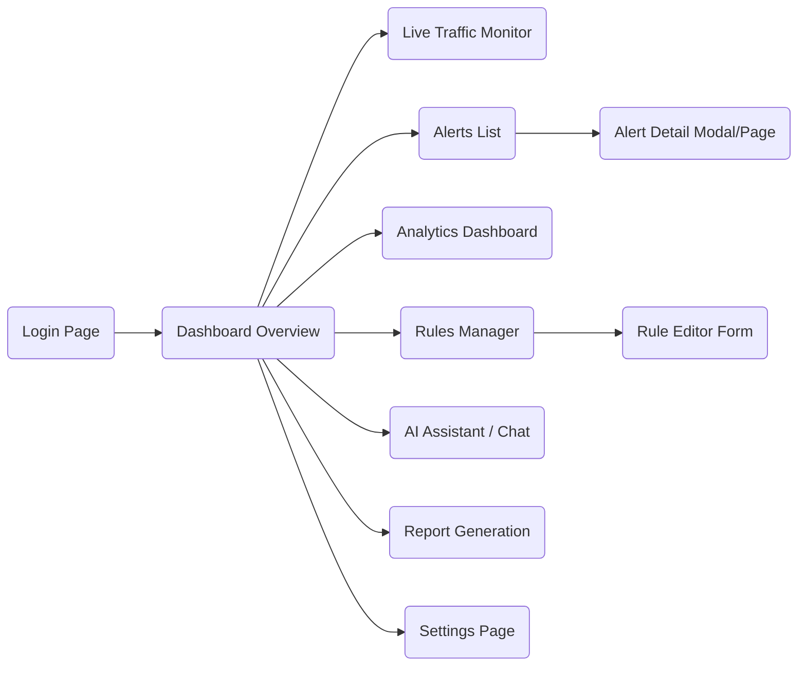
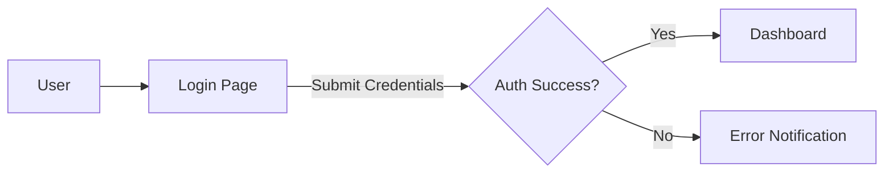
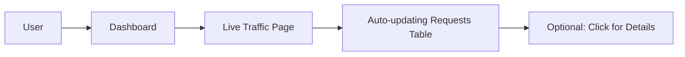
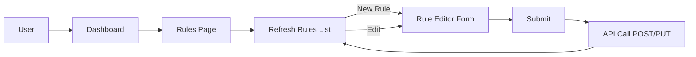
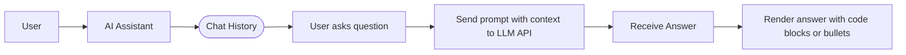

# suraksha Frontend Design Specification

**Executive Summary:** This document defines the frontend design for **suraksha**, an enterprise-grade **intrusion detection and prevention** (IDPS) dashboard. It serves as the single source of truth for UI/UX: outlining **design goals**, **personas**, **information architecture**, **user flows**, **page layouts**, **component specifications**, **design tokens**, and **accessibility** requirements. The goal is to enable a developer (or AI coding assistant) to implement a consistent, accessible, and polished UI using **React**, **Tailwind CSS**, **Recharts**, and **Socket.IO**. Citations from Tailwind, Recharts, and WAI (ARIA/WCAG) are included to justify key design decisions. Diagrams (via Mermaid) show the site map and critical user flows. 

---

## Design Principles

- **Clarity & Hierarchy:** Emphasize critical security signals. Avoid “flat grids” of equal-weight metrics – use **visual hierarchy** so urgent alerts stand out. Studies show security dashboards must “separate the sliver of data that matters” rather than display every metric equally.  
- **Contextual Communication:** Each screen answers a clear question (e.g. “Am I under attack?” on Dashboard, “What threats in the last hour?” on Analytics). Align components to user goals rather than raw data outputs.  
- **Meaningful Color Use:** Use **semantic color palette**: e.g. red for Critical alerts, orange for Warning, green for Safe. Per WANDR, don’t waste “all your reds” on unimportant info; reserve alarm colors for true critical events.  
- **Data-First Simplicity:** Avoid unnecessary charts or gauges. Display critical numbers plainly; add charts only when they add insight. (“Everything-is-a-chart” is an anti-pattern.)  
- **Responsive & Accessible:** Support large data sets and various devices. Follow WAI-ARIA and WCAG for tables, dialogs, and contrasts to ensure usability for all users.  
- **Micro-interactions:** Provide feedback on actions. Animate buttons and modals subtly (e.g. button “shrink on click”) to reinforce actions and improve UX.  

---

## Target Users & Personas

1. **Security Analyst (Alice):** Primary user. Investigates alerts in real time, needs quick insight and explanations.  
   - **Goals:** Identify and triage threats, understand alerts (via explanations), report to management.  
   - **Needs:** Live updates, clear alert details, SHAP/LLM explanations in simple language, ability to create rules.  
   - **Pain Points:** Alert fatigue, lack of context for alerts, difficulty seeing trends amid noise.

2. **Network Administrator (Neil):** Monitors network traffic, tunes rules.  
   - **Goals:** Ensure network health, monitor traffic trends, block threats proactively.  
   - **Needs:** High-level stats (uptime, traffic rate), easy rule management, threat scoring context.

3. **Security Manager (Sam):** Oversees system status and compliance, reviews reports.  
   - **Goals:** Verify security posture, ensure compliance, get digestible summaries.  
   - **Needs:** Overview Dashboard, historical analytics, PDF/CSV reports, risk levels (threat scores).

4. **Student/Learner (Stu):** Uses suraksha as a teaching tool.  
   - **Goals:** Learn how IDS/IPS works in practice.  
   - **Needs:** Explanations for attacks, visible cause-effect (e.g. “why was this blocked?”), interactive Assistant to ask questions.

Each persona informs the design: e.g. Analysts need multi-pane views (charts + tables), Managers need exportable reports and KPIs, Students need guided explanations.

---

## Information Architecture & Sitemap

The UI consists of a top-level navigation and pages as shown below:



- **Login:** Authentication page (username/password form).  
- **Dashboard:** Summarizes system status (KPIs, top threats, map, etc.).  
- **Live Traffic:** Real-time table of incoming requests.  
- **Alerts:** List of flagged incidents (timestamp, source IP, type, score).  
- **Alert Detail:** Detailed view (or modal) showing payload, features, SHAP, etc.  
- **Analytics:** Historical charts (time-series of attacks, types breakdown, etc.).  
- **Rules:** List and management of detection rules (with create/edit forms).  
- **AI Assistant:** Chat-like interface for Q&A and report generation.  
- **Reports:** Generate/download CSV/PDF reports (daily/weekly attack summary).  
- **Settings:** Profile, system config, user management (future).

Navigation is via a side menu (or top bar) with these items. Active section highlights accordingly. 

---

## User Flows

### 1. Login Flow

- **Key:** After successful login (JWT session), user lands on **Dashboard**. On failure, show error.

### 2. Monitor Live Traffic

- **Highlights:** The **Live Traffic** page shows an auto-refreshing table (via Socket.IO) of recent requests (IP, method, payload snippet, port, size, timestamp, threat score).
- **UI Details:** Table columns with sorting and filtering (e.g. filter by IP or threat score). Can click a row to see alert detail (similar to Alerts flow).

### 3. Investigate Alert
```mermaid
flowchart LR
    U[User] --> DB[Dashboard] 
    DB --> A[Alerts Page]
    A --> T[Alerts Table]
    T -->|click alert| M[Alert Detail Modal]
    M --> SHAP[SHAP Explanation Panel]
    M --> LLM[LLM Explanation (textarea)]
    M --> BL[Block IP Action]
```
- **Alerts Page:** Table of alerts (with columns: Date, SrcIP, Type, Severity, Score). Row click opens **Alert Detail** (modal or side panel).
- **Alert Detail:** Shows full request payload, rule/match info, ML features, plus:
  - **SHAP Explanation Panel:** Highlights top contributing features (e.g. “High packet rate, suspicious port”).
  - **LLM Assistant Box:** Answers like “Why was this flagged? How to mitigate?” in human language.
  - **Actions:** “Block IP” button (simulated block), “Add Rule” link.

### 4. Create/Edit Rule

- **Rules Page:** Shows existing signature-based rules. Buttons to Add or Edit rule.
- **Rule Editor:** Form with inputs: “Name”, “Pattern (regex or keyword)”, “Type (SQLi, XSS, etc.)”, “Severity”, “Mitigation Hint”. Submit saves to backend (updates rule DB).

### 5. View SHAP Explanation
This is integrated into the alert detail flow (see #3). SHAP panel must clearly list features and contributions (e.g. table or bars). Example content:
- “High packet rate (feature: requests/min): +0.45 (major)”
- See [WAI ARIA example](#) for table semantics: use `<table>` with `aria-label`.

### 6. AI Assistant Q&A

- **Assistant UI:** Chat interface. System preloads recent incident context. User types questions (“What is SQLi?”, “Why block IP 1.2.3.4?”). Responses come from OpenAI or similar. 
- **Implementation:** Send prompt including current alerts/features, retrieve LLM response, display under chat. 

### 7. Generate Report
```mermaid
flowchart LR
    U[User] --> Rep[Reports Page]
    Rep --> [Select Date Range] 
    Rep --> [Click Generate]
    Generate --> API[getReportData endpoint] 
    API --> Data[Server returns CSV/PDF]
    Data --> U (Download link opens)
```
- **Reports:** Datepicker and buttons for Daily/Weekly/Monthly. On generate, frontend fetches report data, triggers file download (e.g. via blob).

---

## Page-by-Page Specifications

### **Login Page**
- **Layout:** Centered form card. Title "suraksha Login". Inputs: Username, Password, Login button. “Forgot Password?” link. 
- **Components:** Input fields (state: normal, focus, error), Button. 
- **Validation:** Required fields, error messages (ARIA `role="alert"` for error text).
- **Responsive:** Form width adapts, minimal design.

### **Dashboard**
- **KPIs:** Display key metrics (Total Traffic, Attacks Today, Critical Alerts, Blocked IPs) as **cards**. Use hierarchical size: critical alerts card larger or colored. Each card: icon + label + number.  
- **Live Preview:** Mini “Latest Alerts” and “Live Traffic (mini)” sections (clickable to go full page). 
- **Map Widget (optional):** World map of attack sources (hover = IP & count).  
- **Layout:** 2–3 column grid on desktop; stack on mobile. Use flex/grid. 
- **Example:**
  ```jsx
  <div className="grid grid-cols-2 md:grid-cols-4 gap-4">
    <DashboardCard icon="🖥️" label="Active Traffic" value="10,234" color="blue" />
    <DashboardCard icon="⚠️" label="Today’s Attacks" value="12" color="red" />
    <!-- etc. -->
  </div>
  ```
- **Citations:** Emphasize hierarchy (WANDR advises against flat equal tiles; e.g. make “Critical Alerts” visually prominent).

### **Live Traffic Page**
- **Table:** Columns: Time, Src IP, Dest IP, Protocol, Port, Method, Payload Preview, Bytes, Threat Score.  
- **Real-time:** Use **Socket.IO** (client connects on mount) to stream new rows. Latest entries appear at top. 
- **Search/Filter:** Input above table to filter by IP or method.  
- **State Handling:** Idle (no traffic yet), Loading (spinner), Active (auto-updating).  
- **Accessibility:** Use native `<table>` with `<thead>`/`<tbody>` for semantics. Provide `aria-label="Live network traffic"`.

### **Alerts Page**
- **Table:** Columns: Timestamp, Src IP, Attack Type, Threat Score, Severity (badge color-coded), and *View/Block* actions.  
- **Sorting:** By time (desc) by default.  
- **Row Click:** Opens **AlertDetailModal** (see below).  
- **Filtering Tabs:** Quick filters: “All”, “Critical”, “Blocked”. Clicking "Blocked IPs" toggles those.  
- **Accessibility:** Mark alerts table with `aria-label="Active security alerts"` and use focus indicators on rows.

### **Alert Detail (Modal or Side Panel)**
- **Header:** Title (e.g. “Alert Details”), Close button (ARIA `aria-label="Close"`).  
- **Sections:** 
  1. **Request Info:** Show HTTP headers, payload snippet, matched signature (if any).  
  2. **ML Prediction:** “Predicted Attack Type: SQL Injection (99% confident)”, small risk score bar/graphic.  
  3. **SHAP Explanation:** List top features with contributions (e.g. “High packet length: +0.45”). Use a simple list or bullet panel.  
  4. **AI Explanation:** Chat box with the LLM answer (read-only).  
  5. **Actions:** Buttons “Block IP” (danger style), “Add Rule from Pattern”, “Acknowledge”.  
- **Behavior:** Modal traps focus; closing returns focus to originating alert. Ensure modal has `role="dialog"` and `aria-modal="true"`. 
- **Example (JSX skeleton):**
  ```jsx
  function AlertDetailModal({ alert, onClose }) {
    return (
      <Dialog open onClose={onClose} aria-label="Alert Details">
        <div className="p-6">
          <h2 className="text-xl font-bold">{alert.type} detected</h2>
          <div>/* request payload and headers */</div>
          <div>/* SHAP features list */</div>
          <div>/* LLM answer component */</div>
          <button onClick={blockIp}>Block IP</button>
        </div>
      </Dialog>
    );
  }
  ```
  (Using a `<Dialog>` component that follows WAI-ARIA dialog pattern.)

### **Analytics Page**
- **Charts:** 
  - **Time-Series:** Line chart of attacks over time (e.g. last 24h, line chart). 
  - **Attack Types:** Pie or bar chart (distribution of types). 
  - **Sources:** Bar chart of top source IPs or countries. 
  - **Others:** Heatmap (hourly activity), Severity trend. 
- **Components:** Use **Recharts** library. Example props:
  ```jsx
  <LineChart data={attackHistory}>
    <CartesianGrid strokeDasharray="3 3" />
    <XAxis dataKey="time" />
    <YAxis />
    <Tooltip />
    <Line type="monotone" dataKey="count" stroke="#2563EB" dot={false} />
  </LineChart>
  ```
  According to Recharts docs, charts are composed via `<Line>`, `<Bar>`, etc..
- **Data Shapes:** For line chart, use array of `{ time: "10:00", count: 5 }`. For pie, `{ name: "SQLi", value: 40 }`.
- **Update Controls:** Dropdown or tabs to switch timeframe (hour/day/week).
- **Interaction:** Hover to show tooltips. Legend for color mapping. 
- **Layout:** Two-column grid on desktop (charts side-by-side), stacked on mobile. Limit lines to 2–3 for readability (no clutter).

### **Rules Manager Page**
- **List View:** Table of rules: Name, Pattern (snippet), Attack Type, Severity, Actions (Edit/Delete).  
- **Buttons:** “New Rule” above table.  
- **Form (Add/Edit):** Inputs for Name (text), Pattern (text/regex), Attack Type (dropdown), Severity (dropdown), Description/Advice (textarea). Submit/Cancel buttons.  
- **Validation:** Name/pattern required. If regex, validate format.
- **UX:** If edit, pre-fill form. Use modal or separate form page. After submit, refresh list.

### **AI Assistant Page**
- **Layout:** Left pane with "Chat History", right pane is the chat input and list. Or simply one column chat view. 
- **Chat Bubbles:** User messages (right-aligned) vs AI answers (left-aligned). Scrollable history. 
- **Input:** Textarea + Send button. Possibly shortcommands ("/report", "/explain"). 
- **Accessibility:** Labels on input (`aria-label="Ask a question"`). 
- **Context:** Display a small sidebar or toolbar showing current context (e.g. “Context: Latest Alerts”).

### **Reports Page**
- **Form:** Date range pickers or preset (Today, Last 7 days, Last month). Dropdown for format (CSV/PDF). 
- **Generate:** Button triggers backend job. Show spinner while generating. 
- **Result:** Once ready, auto-download (or provide a link). Table of past reports could be listed.
- **Example API:** GET `/api/reports?start=2026-08-01&end=2026-08-07&format=pdf`.

### **Settings Page**
- **Sections:** Profile (change password), System (API keys, email alerts), Manage Users (for multi-user, optional). 
- **Security:** “Logout” button. Show JWT expiration countdown (UX detail). 

### **Global UI Elements**
- **Navigation Bar:** Side menu with icons+labels (Dashboard, Traffic, Alerts, Analytics, Rules, Assistant, Reports, Settings). Collapsible on mobile. 
- **Breadcrumbs:** Show path within app (e.g. Dashboard > Analytics). 
- **Notifications:** Bell icon shows number of new alerts. Clicking shows dropdown of latest alerts. Use a dropdown list with short descriptions. 
- **Color Theme:** Light and Dark mode (use `class="dark"` with Tailwind). Ensure all semantic tokens have dark variants.
- **Error/Loading States:** All data-fetch components show spinners (Tailwind’s `animate-spin` on an SVG) or placeholder skeletons. 
- **Empty States:** If no data (e.g. no alerts), show friendly message (“No alerts found. Your network is clean!”) with an illustration icon.

---

## Component Library

Define reusable components with props. Use Tailwind styling:

| Component             | Description                                                       | Key Props / State                     | Variants                            |
|-----------------------|-------------------------------------------------------------------|---------------------------------------|-------------------------------------|
| `DashboardCard`       | KPI card on Dashboard                                              | `icon`, `label`, `value`, `color`     | sizes (sm/md), variant (compact)    |
| `LiveTrafficTable`    | Real-time traffic table                                            | `columns`, `data`, `onRowClick`       | [show/hide columns]                 |
| `AlertsTable`         | Table of alerts with actions                                       | `alerts`, `onView`, `onBlock`         | [highlight row if critical]         |
| `AlertDetailModal`    | Modal showing alert info and explanations                         | `alert`, `onClose`                    | [fullscreen (mobile)]               |
| `AnalyticsChart`      | Wrapper for Recharts (Line/Bar/Pie)                                | `type`, `data`, `xKey`, `yKey`        | [with/without legend]               |
| `RuleEditorForm`      | Form for adding/editing detection rules                            | `initialRule`, `onSubmit`             | [create vs edit mode]               |
| `AIAssistantChat`     | Chat interface for AI Q&A                                         | `messages`, `onSendMessage`           | [dark/light bubble]                 |
| `ReportGenerator`     | Date selectors and generate button                                 | `onGenerate`, `reportTypeOptions`     | [inline/drawer]                     |
| `NavItem`             | Side menu item (icon + label)                                      | `icon`, `label`, `active`             | [collapsed icon-only]               |
| `Button`              | Styled button                                                    | `label`, `onClick`, `type`            | primary, secondary, danger, outline |
| `Input`              | Text input field                                                  | `label`, `value`, `onChange`, `type`  | text, password, number, with icon   |
| `Select`             | Dropdown select                                                   | `options`, `value`, `onChange`        | multiselect, single, searchable     |
| `Modal`/`Dialog`     | General modal dialog                                               | `open`, `title`, `onClose`, `children`| small, large, fullscreen            |
| `Table`              | Generic table (with pagination optional)                         | `columns`, `data`                     | striped, hoverable                  |
| `Badge`              | Status/Severity badge                                             | `label`, `color`                      | pill, dot only                      |
| `ChartTooltip`       | Custom tooltip for charts                                         | `content` (string or JSX)             | ——                                  |
| `Avatar`             | User or IP icon                                                   | `src` or `text`, `size`               | circle, square                      |
| `Loader`             | Spinner or skeleton                                               | `size`, `type` (`spinner`/`bars`)      | ——                                  |
| `Toast`              | Temporary notification                                           | `message`, `type` (success/error/info)| auto-dismiss, manual close          |
| `Dropdown`           | Generic dropdown menu                                             | `items`, `onSelect`                   | context menu style                  |
| `Toggle`            | Switch (light/dark, on/off)                                       | `checked`, `onChange`                 | ——                                  |

> **Component Props Table:** We list important props. For example, `DashboardCard` might have `{ icon: string; label: string; value: number|string; color: 'blue'|'green'|'orange'|'red' }`. These drive styling (e.g. `text-blue-500` for primary color).  

Code Skeleton (JSX) for sample components:

```jsx
// Example: DashboardCard.jsx
export function DashboardCard({ icon, label, value, color }) {
  return (
    <div className={`p-4 bg-white dark:bg-gray-800 rounded shadow-md flex items-center space-x-4`}>
      <div className={`text-${color}-500 text-3xl`}>{icon}</div>
      <div>
        <div className="text-gray-500 dark:text-gray-400">{label}</div>
        <div className={`text-2xl font-semibold text-${color}-600`}>{value}</div>
      </div>
    </div>
  );
}
```

```jsx
// Example: LiveTrafficTable.jsx
export function LiveTrafficTable({ data, onRowClick }) {
  return (
    <table className="min-w-full table-auto" aria-label="Live Traffic">
      <thead className="bg-gray-100">
        <tr>
          <th>Time</th><th>Src IP</th><th>Dest IP</th><th>Proto</th><th>Port</th><th>Method</th><th>Size</th><th>Score</th>
        </tr>
      </thead>
      <tbody>
        {data.map((row, i) => (
          <tr key={i} onClick={() => onRowClick(row)} className="hover:bg-gray-50 cursor-pointer">
            <td>{row.time}</td><td>{row.src}</td><td>{row.dest}</td><td>{row.proto}</td><td>{row.port}</td>
            <td>{row.method}</td><td>{row.size}</td><td><span className="font-mono">{row.score}%</span></td>
          </tr>
        ))}
      </tbody>
    </table>
  );
}
```

*(More detailed component specs would include all props, events, and any keyboard/accessibility behavior.)*

---

## Design System & Tokens

We define a **semantic token system** built on Tailwind’s default palette. Tokens allow easy theming and dark mode support. Below are key tokens:

### Color Palette

Semantic colors, mapped to Tailwind shades (with dark variants):

| Token Name       | Light Mode Hex     | Dark Mode Hex      | Usage                                      |
|------------------|--------------------|--------------------|--------------------------------------------|
| `--color-primary` | `#2563EB` (blue-600) | `#3B82F6` (blue-500) | Primary brand color (buttons, links)       |
| `--color-secondary` | `#14B8A6` (teal-500) | `#2DD4BF` (teal-400) | Secondary actions, highlights             |
| `--color-success` | `#16A34A` (green-600) | `#22C55E` (green-500) | Success messages/badges                   |
| `--color-warning` | `#CA8A04` (yellow-600) | `#FACC15` (yellow-400) | Warnings or medium threats               |
| `--color-error`   | `#DC2626` (red-600)  | `#EF4444` (red-500)  | Critical alerts, error states            |
| `--color-info`    | `#3B82F6` (blue-500) | `#60A5FA` (blue-400)  | Informational text                      |
| `--color-bg`      | `#FFFFFF` (white)    | `#1F2937` (gray-800)  | Background (light/dark)                 |
| `--color-surface` | `#F3F4F6` (gray-100) | `#111827` (gray-900)  | Card/Paper background                   |
| `--color-text-primary` | `#111827` (gray-900) | `#F9FAFB` (gray-50) | Main text color                        |
| `--color-text-secondary` | `#4B5563` (gray-600) | `#9CA3AF` (gray-400) | Secondary text                         |
| `--color-border`  | `#D1D5DB` (gray-300) | `#374151` (gray-700) | Border lines / dividers                |
| `--color-muted`   | `#6B7280` (gray-500) | `#6B7280` (gray-500) | Disabled text / icons                  |

*(Colors chosen from Tailwind’s default palette. Adjust via Tailwind config if needed. These tokens can be implemented as CSS variables or directly as classes.)*

### Typography

We use Tailwind’s typography scale:

- **Base font:** `text-base` = 1rem (16px).  
- **Headings:** 
  - `text-4xl` (2.25rem, 36px) for main page titles.  
  - `text-2xl` (1.5rem, 24px) for section headings.  
  - `text-xl` (1.25rem, 20px) for card titles.  
- **Body text:** `text-base` (16px) by default, `text-sm` (14px) for captions.  
- **Line heights:** default Tailwind line-heights (1.5 for base). Use classes like `leading-relaxed` for paragraphs.  
- **Font weights:** Use `font-semibold` for emphasis (titles), `font-medium` for buttons, `font-normal` for body.

| Element              | Tailwind Class | Size (px) |
|----------------------|----------------|-----------|
| Heading 1 (Dashboard) | `text-4xl`    | 36px      |
| Heading 2 (Section)   | `text-2xl`    | 24px      |
| Heading 3             | `text-xl`     | 20px      |
| Body Text             | `text-base`   | 16px      |
| Small Text (captions) | `text-sm`     | 14px      |
| Mono (code, scores)   | `font-mono`   | 14px      |

*(Tailwind docs list `text-4xl = 2.25rem` etc.. Use these classes for consistency.)*

### Spacing Scale

Tailwind’s default spacing (0 = 0px, 1 = 4px, 2 = 8px, 3 = 12px, 4 = 16px, 5 = 20px, 6 = 24px, etc.). We use multiples of 4px for padding/margins. 
- e.g., `p-4` = 16px padding; `mt-2` = 8px margin top.
- **Grid gaps:** `gap-4` (16px) standard between cards or table rows. 
- **Container padding:** `px-6 py-4` on main content. 
- **Responsive breakpoints:** Tailwind’s `sm`, `md`, `lg` suffixes (sm=640px, md=768px, lg=1024px). E.g. `md:grid-cols-2` for dashboards.

### Iconography & Imagery

- Use a consistent icon set (e.g. Heroicons or FontAwesome) for universal symbols (alerts, search, settings).
- Illustrations for empty states (optional) should be simple and not distracting.
- All icons must have `aria-hidden="true"` if purely decorative.

### Animations & Interactions

- **Button tap:** On press, button scales to 0.95× (see example in ICS article). Use CSS/Framer Motion for press animation.  
- **Ripple effect:** For clickable elements, a brief ripple (tailwind does not have built-in, can use JS/Framer Motion). ICS example: on click create expanding circle with opacity fade.  
- **Modals:** Fade in/out with slight scale (e.g. Framer Motion variants). APG suggests ensuring focus management.  
- **Loading spinners:** Use Tailwind `animate-spin`. Could use a simple SVG (Spinner) or Tailwind UI spinner pattern.  
- **Chart animations:** Recharts can animate lines on mount (via `animationDuration`). Use moderate animation (0.5s).  
- **Hover:** Table rows highlight (`bg-gray-50`) on hover for clarity. Buttons slightly darken on hover (`hover:bg-blue-700`).  
- **Focus:** All interactive elements (buttons, inputs) must have visible focus rings (`focus:ring`) for keyboard accessibility.  

### Responsive Design

- **Breakpoints:** Tailwind defaults: `sm (640px)`, `md (768px)`, `lg (1024px)`, `xl (1280px)`. 
- **Mobile Layout:** Collapse side menu to hamburger. Dashboard cards become single column on `sm`. Charts stack vertically. 
- **Touch Targets:** Minimum 44×44px for buttons/links.
- **Hide non-critical:** On very small screens, hide secondary charts or collapse analytics into accordion.

### Accessibility (WCAG 2.1 / WAI-ARIA)

- **Contrast:** Follow WCAG contrast ratios: normal text ≥4.5:1, large text ≥3:1. Example: use `text-gray-900` on white (21:1) meets AAA. For dark mode, `text-gray-50` on gray-800 also high contrast. 
- **Semantic HTML:** Use `<button>`, `<input>`, `<table>` tags rather than generic `<div>`. For tables, WAI-ARIA advises native tables when possible. 
- **ARIA Roles:** 
  - Tables: add `aria-label` or `<caption>` to describe. 
  - Modals/Dialog: use `role="dialog"`, `aria-modal="true"`, and manage focus trap.  
  - Icons/buttons: provide `aria-label` if icon alone (e.g. `<button aria-label="Block IP">🔒</button>`). 
- **Keyboard:** Ensure all functionality (navigate pages, open alert, chat input) works via Tab/Enter. 
- **Forms:** Label inputs explicitly or with `aria-label`. Mark required fields. Error messages with `role="alert"`. 
- **Notifications:** ARIA-live region for real-time alert count or incoming alerts to announce to screen readers.

### Dark Mode

Use Tailwind’s `dark:` variant for colors (e.g. `bg-white dark:bg-gray-800` for cards). Semantic tokens double as their inverted shades above. Provide a toggle in Settings or follow system preference (`prefers-color-scheme`). Ensure focus rings and shadows look good in dark mode.

---

## Data & API Mappings

While backend details are outside scope, map UI-to-API for clarity:

| UI Action                | Endpoint              | Method | Request Body (sample)               | Response (sample)                |
|--------------------------|-----------------------|--------|-------------------------------------|----------------------------------|
| **Get Dashboard Stats**  | GET `/api/overview`   | GET    | —                                   | `{traffic:1000, attacks:50, ...}` |
| **Stream Live Traffic**  | *Socket.IO* `/traffic`| —      | — (client connect)                  | events: `{time, src, ...}`       |
| **Fetch Alerts List**    | GET `/api/alerts?since=...` | GET | query params (date range)         | `[{id, src, type, score,...}, ...]` |
| **Fetch Alert Detail**   | GET `/api/alerts/{id}`| GET    | —                                   | `{id, src, dest, payload, shapReasons, ...}` |
| **Block IP**             | POST `/api/block`     | POST   | `{ ip: "1.2.3.4" }`                 | `{success:true}`                |
| **Get Analytics Data**   | GET `/api/analytics?range=...` | GET | —                  | e.g. `[{time: "10:00", attacks:10}, ...]`  |
| **Get Rules**            | GET `/api/rules`      | GET    | —                                   | `[{id,name,pattern,type,severity},...]`    |
| **Create Rule**          | POST `/api/rules`     | POST   | `{name, pattern, type, severity, desc}` | new rule object                 |
| **Update Rule**          | PUT `/api/rules/{id}` | PUT    | `{...}`                             | updated rule                   |
| **Delete Rule**          | DELETE `/api/rules/{id}` | DELETE| —                                 | `{success:true}`                |
| **Chat Query**           | POST `/api/assistant` | POST   | `{question: "Why was X blocked?"}`  | `{answer: "Because...", ...}`   |
| **Generate Report**      | POST `/api/reports`   | POST   | `{startDate, endDate, format:"pdf"}`| binary/PDF download            |

*(Adjust paths as per backend. Use JSON. Socket.IO events: client emits subscribe, server pushes events.)*

---  

## Frontend Architecture & Folder Structure

Organize as a **monorepo** style for clarity:

```
src/
├─ components/         # Reusable React components
│   ├─ DashboardCard.jsx
│   ├─ LiveTrafficTable.jsx
│   ├─ AlertDetailModal.jsx
│   ├─ RuleEditorForm.jsx
│   ├─ AIAssistantChat.jsx
│   └─ ... (Buttons, Inputs, Modals, etc.)
├─ pages/              # Page components (one per route)
│   ├─ LoginPage.jsx
│   ├─ DashboardPage.jsx
│   ├─ LiveTrafficPage.jsx
│   ├─ AlertsPage.jsx
│   ├─ AnalyticsPage.jsx
│   ├─ RulesPage.jsx
│   ├─ AssistantPage.jsx
│   ├─ ReportsPage.jsx
│   └─ SettingsPage.jsx
├─ contexts/           # React Contexts (Auth, Socket, Theme)
│   ├─ AuthContext.js
│   └─ SocketContext.js
├─ hooks/              # Custom hooks (useAuth, useSocket, useFetch)
├─ services/           # API service modules (api.js with fetch/axios)
├─ styles/             # Tailwind config, global CSS
└─ utils/              # Utility functions (formatters, validators)
```

- **State Management:** Use React Context or Redux for global state (e.g. user auth, theme, alerts). A `SocketContext` can provide real-time data streams to components.  
- **Routing:** React Router (or similar). Routes for each page above. Protect `/dashboard` & others behind login (redirect if no JWT).  
- **Communication:** Use `socket.io-client` for realtime. Example from Socket.IO guide: connect in a module (`socket.js`) and use `socket.on('traffic', handler)` in components.

---

## Testing Strategy

Ensure quality with multi-level tests:

- **Unit Tests (Jest):** Test pure functions (e.g. threat scoring, data formatters).  
- **Component Tests (React Testing Library):** Test key components render and respond (e.g. DashboardCard shows correct text, LiveTrafficTable rows).  
- **E2E Tests (Cypress or Playwright):** Simulate user flows: login, viewing dashboard, creating rule, chatting with AI.  
- Example: Jest+RTL testing form submission; Cypress to verify “Block IP” button disables on click. These follow modern best practices.  

*(We assume presence of testing libraries; not detailed here.)*

---

## Conclusion

This design spec should guide the frontend implementation of suraksha. It details all UI facets from the user journeys to pixel-level components, including **design rationale** and **accessibility** considerations. By following this, the resulting product will be a polished, user-friendly SOC interface. All components and pages are justified by established UX patterns and technical documentation:

- Tailwind CSS provides the base design system.  
- Recharts offers composable React charts for analytics.  
- WAI-ARIA/WCAG guidelines ensure accessibility.  
- Security dashboard best practices guide the layout and alerts emphasis.  

This document, along with technical architecture docs, will allow an AI coding agent or developer to build the frontend consistently without guesswork.