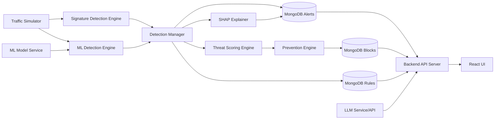
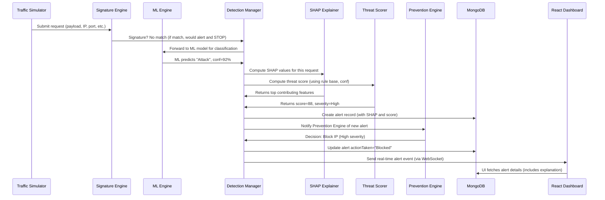

# suraksha – Explainable Hybrid Intrusion Detection & Prevention Platform

## Executive Summary

suraksha is a comprehensive web-based **Intrusion Detection and Prevention System (IDPS)** that combines signature-based detection, machine learning anomaly detection, and explainable AI to protect networks in real time.  It integrates classic rule matching with advanced analytics to identify both known and novel attacks, and presents detections in a modern Security Operations Center (SOC) dashboard.  

Key capabilities include:  monitoring live network traffic, applying signature rules for common exploits (e.g. SQL injection, XSS), running a trained ML model to catch unknown threats, and using SHAP explainability and an LLM to clarify *why* an alert was raised.  Every event is scored by risk level (aligned with CVSS severities) and can trigger simulated prevention actions (e.g. IP blocking).  Administrators can customize detection rules, view interactive charts (attack timelines, top attackers, geolocation), and generate incident reports.  

The system is built with a **modern tech stack** (React + Node.js + FastAPI + MongoDB + Python ML).  Traffic is simulated or fed from Snort logs, processed by detection engines, and visualized via a real-time React dashboard.  By bridging academic IDS concepts with practical, explainable AI, suraksha not only meets the syllabus requirements (signature detection, anomaly detection, Snort integration, etc.) but also demonstrates professional SOC features (trend analysis, drill-down, role-based views) and emerging AI techniques. 

Below is a detailed Product Requirements Document (PRD) covering all aspects of suraksha: background, goals, users, features, technical design, ML pipeline, APIs, scoring, deployment, testing, timelines, and references.  

## Background

Network security relies on detecting malicious activity.  Traditional **Intrusion Detection Systems (IDS)** use **static signatures** of known attacks to scan traffic, while **anomaly-based IDS** use statistical or machine learning models to spot deviations from “normal” traffic.  Snort, the leading open-source IDS/IPS, uses rule-based signatures to flag packets.  However, signature-based systems cannot detect new or obfuscated attacks, and ML-based systems often lack transparency.  Furthermore, many educational IDS demos only log alerts without good visualization or explanation.

Recent research emphasizes that modern IDS should not only be accurate but also *explainable*.  Analysts need to understand why a traffic pattern was flagged to trust the system and respond effectively.  Large Language Models (LLMs) like GPT-4 can augment IDS by translating technical alerts into human-readable incident reports.  By combining these insights, suraksha fills the gap: a hybrid IDS/IPS that uses both rules and AI, and that provides clear, contextual information for each detection.

## Problem Statement

- **High Threat Volume**: Networks receive thousands of requests/minute.  Malicious payloads (SQL injections, XSS, port scans, brute force logins, etc.) are interspersed with benign traffic.  Detecting these reliably and *in context* is challenging.  

- **Limitations of Signatures**: Signature-based detection catches only known patterns.  Unknown or mutated attacks evade these rules.  Manual rules also generate many false alerts.  

- **Lack of Explainability**: Pure ML IDS can classify traffic but act as a “black box”.  Security teams often mistrust unexplained alerts.  Without knowing *why* something was flagged, it’s hard to make remediation decisions.  

- **No Prevention in Demos**: Academic projects often log attacks but do not simulate or implement any countermeasures.  In practice, IPS can block or throttle attackers automatically.  

- **Insufficient Analytics**: Security dashboards frequently lack comprehensive visualizations.  Effective SOC dashboards require real-time charts, filtering, and trend identification.  

**suraksha** addresses these issues by integrating multiple detection techniques, generating human-friendly explanations and recommendations via AI, and providing an interactive SOC-style UI.  It bridges theory (IDS/IPS concepts) and practice (live monitoring, attack simulation, SOC metrics).

## Vision

Develop an enterprise-style security platform for educational use that:

- **Detects and blocks** network threats in real time, using both known signatures and AI-based anomaly detection.
- **Explains decisions** transparently, using feature-based analysis (SHAP) and natural-language summaries (LLM).
- **Empowers analysts** with a responsive, data-rich dashboard for monitoring and reporting.
- **Simulates prevention**, demonstrating how malicious actors can be automatically mitigated.
- **Serves as a teaching tool**, covering all core concepts of intrusion detection/prevention in a unified system.

By the end of development, suraksha should look and feel like a (simplified) commercial SOC product, impressing evaluators with its completeness and technical depth.

## Objectives

- **Cover syllabus topics**: Implement signature analysis, anomaly (ML) detection, host/network IDS aspects, rules, sensors/managers, Snort basics (installation/logs), etc.
- **Real-time operation**: Continuously process incoming requests, detect attacks, and update UI instantly (use WebSockets).
- **Hybrid detection**: Combine a rules engine (for known exploits) with a trained ML model (for unknown attacks).
- **Explainability**: Use SHAP to highlight top features for each ML alert, and an LLM to generate plain-language descriptions.
- **Prevention actions**: On high-severity detections, simulate actions (block IP, throttle).
- **Rich UI/UX**: Provide dashboards with live traffic feeds, attack logs, charts (timeline, top attackers, by type), and search/filter capabilities.
- **Customization**: Allow adding/editing detection rules (CVE references, descriptions).
- **Reporting**: Generate scheduled or on-demand reports (daily/weekly) exporting CSV/PDF.
- **Accuracy and trust**: Achieve high detection rates (target ≈90%+ precision/recall on benchmark tests) and low false positives.

## Scope

**In Scope** (will be implemented):

- **Network traffic simulation**: A module to generate synthetic requests including benign and attack payloads.
- **Signature-based engine**: A rule parser and matcher for payloads (e.g. detecting “`<script>`” for XSS, or “`UNION SELECT`” for SQLi).
- **ML anomaly engine**: Train and serve a classifier on intrusion datasets (NSL-KDD, CICIDS2017, UNSW-NB15).
- **Explainable AI**: Integrate SHAP for per-alert feature importance; connect to an LLM (e.g. GPT) for narrative explanations.
- **Prevention simulation**: IP blacklist, request blocking, alert escalation.
- **Real-time dashboard**: React UI showing live feed, alerts, stats, charts, and controls (filter, rule editor).
- **API backend**: RESTful/WS APIs (Express + FastAPI) for frontend, detection engines, and ML service.
- **Data storage**: MongoDB schemas for traffic logs, alerts, users, rules, reports.
- **User management**: Simple auth (JWT), roles (admin/viewer).
- **Core detections**: At minimum – SQL Injection, Cross-Site Scripting (XSS), Directory Traversal, Port Scans, Brute Force, DoS floods, plus normal/unknown traffic.
- **Snort integration (optional)**: Read Snort alert logs as input to dashboard.

**Out of Scope** (will not be implemented):

- Real packet capture from live networks or integration with enterprise network hardware.
- Actual firewall or OS-level changes (no root privileges; simulate blocking only).
- Complete penetration testing features or exploits generation beyond simple payloads.
- Compliance reporting beyond the built-in dashboard.
- Multi-tenant or large-scale enterprise deployment (our focus is on a single-site demo).
- Legacy Snort v2; only Snort 3 or logs.
- Deep learning (e.g. CNN, LSTM) due to complexity/time; focus on tree ensembles.
- Complex user interface beyond key dashboard needs (no admin consoles for every micro-feature).

## Target Users

- **Security Analysts**: Use suraksha’s dashboard to monitor network security, investigate alerts, and respond to incidents. They need real-time visibility and detailed alert context.
- **Network Administrators**: Ensure network integrity. They configure detection rules, review blocked IPs, and generate routine reports.
- **Students/Learners**: Explore IDS/IPS concepts. They should be able to interact with the platform to see how attacks are detected, learn about threats, and experiment with rules and models.
- **Instructors/Faculty**: Assess student understanding via project demos. They expect a polished UI and clear evidence of all syllabus topics (signature rules, anomaly detection, Snort basics, etc.).

## User Personas

1. **Alice, SOC Analyst (Mid-20s)**  
   - *Goals*: Spot ongoing attacks, triage incidents, prevent breaches.  
   - *Needs*: A real-time dashboard with alerts, ability to drill down into details, and explainable recommendations.  
   - *Pain Points*: Cluttered logs, unclear alerts, too many false positives.

2. **Bob, Network Admin (30s)**  
   - *Goals*: Maintain network uptime, enforce security policies.  
   - *Needs*: Ability to define and tweak detection rules, see blocked IPs, generate daily security reports.  
   - *Pain Points*: Managing rule sets, correlating incidents to vulnerabilities (CVEs), demonstrating ROI.

3. **Carol, Student (20s)**  
   - *Goals*: Learn how IDS/IPS works in practice.  
   - *Needs*: Intuitive interface, clear explanations of attacks, example attacks to test.  
   - *Pain Points*: Jargon-heavy logs, black-box ML, difficulty understanding alerts.

4. **Dr. Dave, Course Instructor (40s)**  
   - *Goals*: Evaluate student projects, ensure coverage of curriculum.  
   - *Needs*: A comprehensive demonstration of theory (signatures, anomalies, alerts) in a cohesive application.  
   - *Pain Points*: Projects that only implement trivial detection or lack integration of key concepts.

## Functional Requirements

This section lists specific features and capabilities the system must provide.

### Authentication & User Management

- **FR-001**: Administrator login with username/password. (JWT-based sessions)  
- **FR-002**: Role-based access (at least “Admin” and “Viewer”). Only Admins can change rules or settings.  
- **FR-003**: Passwords stored hashed (bcrypt or similar).  
- **FR-004**: Session expiration/inactivity timeout (e.g. 30 min).

### Dashboard

- **FR-010**: Upon login, display a Dashboard summary view with key metrics:  
  - Total traffic volume (past 24h)  
  - Total detected attacks (today)  
  - Blocked IP count  
  - Active threats (critical alerts open)  
  - System health (uptime, data rate).  

- **FR-011**: Allow toggling between light/dark modes for readability.  

- **FR-012**: Display live “Traffic Feed” panel showing each request as it’s processed: timestamp, source IP, request summary, detection status (Normal/Alert), threat score.  

- **FR-013**: Provide filter/search on the traffic feed (by IP, type, time).  

- **FR-014**: Show live charts:  
  - **Attack Timeline**: line chart of attacks/hour.  
  - **Attack Types**: pie/bar of attack categories (SQLi, XSS, etc.).  
  - **Top Attackers**: list of IPs with most alerts.  
  - **Geographic Map** (optional): if source geo data is known, highlight origin locations.  

- **FR-015**: Charts update in real time (using WebSockets) and allow drill-down (e.g. clicking on a spike shows detailed events).  

- **FR-016**: “Alerts” view: List of alerts with details (time, IP, type, severity, description, detected-by (signature/ML), explanation summary).  Includes pagination and sorting by time or severity.  

- **FR-017**: Clicking an alert opens a detail view: full payload content, detection rule, SHAP feature list, CVE links, recommended fixes.  

### Live Traffic Monitoring

- **FR-020**: System shall continuously ingest simulated or real network events with fields: source IP, destination IP, timestamp, protocol (TCP/UDP/HTTP), request details (URL, method, payload), port, packet size, etc.  

- **FR-021**: Traffic may be generated by an internal simulator or by feeding test logs (e.g. Snort alert output).  

- **FR-022**: The system shall timestamp and store all incoming requests in a “traffic log” collection.  

- **FR-023**: If Snort mode is enabled, parse Snort alert log entries as inputs to the detection engine.

### Signature-Based Detection

- **FR-030**: Implement a rule engine that scans each request’s payload and metadata against a set of signature rules (simple string or regex patterns).  

- **FR-031**: Initially support detection of:  
  - **SQL Injection**: patterns like `UNION SELECT`, `DROP TABLE`, `' OR '1'='1` etc..  
  - **Cross-Site Scripting (XSS)**: `<script>` tags or other suspicious HTML injections.  
  - **Command Injection**: common shell metacharacters in unexpected places.  
  - **Directory Traversal**: occurrences of `../` or `%2e%2e%2f`.  
  - **Port Scan**: same IP contacting multiple target ports in short time.  
  - **Brute Force Login**: e.g. 5 failed logins within 1 minute.  

- **FR-032**: Rules should have metadata: name, description, severity (Low/Med/High), associated CVE(s) if any, and pattern definition.  

- **FR-033**: Upon a signature match, generate an alert immediately (skip ML stage) with type “Signature”.  Alert includes matched rule details and associated CVE(s).  

- **FR-034**: Rules database should be editable via admin UI (add, modify, enable/disable).

### Machine Learning Detection

- **FR-040**: For traffic that triggers **no signature**, pass request features to the ML model.  

- **FR-041**: The ML model classifies each request (or session) as Normal vs Attack.  For attacks, it may also output a category or anomaly score.  

- **FR-042**: Use pre-trained classifiers (e.g. RandomForest, XGBoost or LGBM) trained on benchmark intrusion datasets (NSL-KDD, CICIDS2017, UNSW-NB15).  

- **FR-043**: Display ML output: predicted label and confidence score (0–100%).  

- **FR-044**: If predicted as Attack (above a confidence threshold, e.g. 90%), generate an alert with type “Anomaly”.  

- **FR-045**: The system shall log ML features for each decision to enable explanation.

### Explainable AI

- **FR-050**: Integrate SHAP (SHapley Additive exPlanations) to identify which input features most influenced each ML decision.  

- **FR-051**: For every ML-based alert, compute a SHAP summary showing the top 3–5 features (e.g. “packet size high”, “destination port 22”, “multiple fails”).  Display these in the alert detail (e.g. “Top factors: PacketSize, RequestRate, FailedLoginCount”).  

- **FR-052**: Provide a global feature importance chart to show which features are most influential overall (on the Analytics page).

- **FR-053**: Use an LLM (e.g. GPT-4 via API) as an “AI Security Assistant” to translate alerts into plain language and recommendations.  Example prompts:  
  - *User:* “Explain this SQL Injection alert.”  
  - *System:* (LLM) “The request contained the substring `'UNION SELECT'`, a known technique to combine malicious queries. This likely indicates a SQL injection attack. The alert was triggered due to unexpected SQL keywords in the input.”  
  - LLM then suggests mitigations (e.g. input validation, parameterized queries).  

- **FR-054**: The AI Assistant should also handle questions like “Why was IP 10.0.0.5 blocked?”, or “How to prevent XSS?”, using the alert context as input to the LLM.

### Prevention Engine

- **FR-060**: When an alert is generated (signature or ML), classify its severity (Low/Med/High/Critical).  Use this and a policy to decide action.  

- **FR-061**: Possible simulated actions:  
  - **Log only** (low severity).  
  - **Block IP**: add the source IP to a blacklist for a configurable timeout (e.g. 10 min).  
  - **Throttle**: temporarily reduce allowed rate from that IP.  
  - **Notify**: simulate sending an email/SMS alert to admin (for demo, just log).  

- **FR-062**: All blocked IPs are recorded in a collection. The dashboard lists “Active Blocks” with expiry times.  

- **FR-063**: Once an IP is blocked, all future requests from it are labeled “Blocked” and not processed further (except logged).

- **FR-064**: Prevention rules (e.g. “block IP if 5 attacks in 1 min”) should be configurable.

### Reporting

- **FR-070**: Generate periodic reports (daily, weekly) summarizing: number of attacks by type, top attackers, system uptime, etc.  Exportable as CSV/PDF.

- **FR-071**: On-demand “Incident Report” generation: Admin can request a report for a custom date range.

- **FR-072**: Reports should include narrative summaries (can leverage LLM for writing a report based on stats).

### Rule Manager

- **FR-080**: Admin interface to create/edit detection rules.  A rule includes: Name, Attack Type, Pattern (string or regex), Severity, Description, CVE links (optional), and whether to auto-block.  

- **FR-081**: Rules are versioned and stored in the DB.  UI should validate patterns.

- **FR-082**: Rules can be enabled/disabled at runtime.

### API

- **FR-090**: Provide REST API endpoints for all data:  
  - `POST /login` (body: creds) → token  
  - `GET /traffic` (list logs, filter by IP/date)  
  - `GET /alerts` (list alerts, filter by type/severity)  
  - `GET /alerts/:id` (alert detail)  
  - `GET /dashboard/summary` (metrics: totals, counts)  
  - `GET /stats/attacks` (time series)  
  - `GET /rules` (list detection rules)  
  - `POST /rules` (create)  
  - `PUT /rules/:id` (update)  
  - `DELETE /rules/:id`  
  - `GET /blocked_ips` (active blocks)  
  - `POST /reports` (generate report)  
  - *Example:* `POST /rules` body:  
    ```json
    { "name": "SQLi1", "pattern": "UNION SELECT", "type": "SQL Injection", "severity": "High", "cve": "CVE-2019-XXXX" }
    ```  
    *Response:* `201 Created` with new rule ID.  

- **FR-091**: Use JSON for requests/responses.  Include example payloads in API documentation (Swagger or Markdown).

- **FR-092**: Protect APIs with JWT tokens (via header).  Non-auth endpoints: maybe `/health` and static content.

## Non-Functional Requirements

### Performance & Scalability

- **NRF-100**: The detection pipeline must process at least **500 requests per second** (configurable) without backlog.  
- **NRF-101**: Dashboard updates should be near real-time (UI updates <1 second after event).  
- **NRF-102**: ML inference time should be low (<50ms per request) to support scale (RF/XGB models are typically fast).  
- **NRF-103**: System should handle bursts (e.g. 10K concurrent events) with graceful degradation (e.g. queueing).  
- **NRF-104**: API response times <500ms (except for heavy operations like training).

### Reliability & Availability

- **NRF-110**: The system shall run 24/7 with at least **99% uptime** (dev/test context).  Use Docker containers for ease of restart.  
- **NRF-111**: Automatic restart on crash (Docker policies, PM2 for Node).  
- **NRF-112**: Data persistence in MongoDB with journaling enabled to prevent loss.

### Security

- **NRF-120**: Use HTTPS/WSS for all external communications (encrypt API and WebSocket traffic).  
- **NRF-121**: Sanitize and validate all user inputs (especially rule patterns) to prevent injection attacks in the application.  
- **NRF-122**: Store secrets (DB credentials, JWT keys) securely (environment vars, not hard-coded).  
- **NRF-123**: Limit login attempts per user/IP to prevent brute force on the admin account.  
- **NRF-124**: Implement CORS policies restricting UI origin (if hosted separately).  

### Maintainability & Extensibility

- **NRF-130**: Use modular, well-documented code (clean architecture).  Separate concerns: frontend, backend, ML service.  
- **NRF-131**: Comment code and maintain up-to-date README and developer docs.  
- **NRF-132**: Use linting and code style guides (rules.md should detail conventions).  
- **NRF-133**: CI pipeline (optional) with automated tests for main features.  
- **NRF-134**: Clear error logging (Winston or similar) for all components.

### Data Volume

- **NRF-140**: Expect to store ~1 million traffic log entries and alerts in MongoDB within project lifetime.  Design indexes on timestamp and IP for queries.

## Core Modules and Components

1. **Traffic Simulator**: Generates synthetic network requests to feed the system.  Modes may include normal traffic, scheduled attacks, or replay of recorded logs.

2. **Signature Engine**: In the backend, applies configured signature rules to each incoming request.  If a rule matches, it creates a high-priority alert immediately.

3. **ML Anomaly Engine**: A Python ML service (FastAPI) running a trained classifier.  Features are extracted (e.g. numeric encodings of payload) and sent to the model.  If classification = attack, an alert is created.

4. **Threat Scoring Engine**: Computes a threat score (0–100) for each alert.  Uses factors like rule severity (mapped from CVSS), ML confidence, repeat offense count.  This score drives severity levels and UI coloring.

5. **Explainability Engine (SHAP)**: For ML alerts, computes SHAP values to explain feature impact.  Outputs a short list of key contributing features.  Generates a JSON explanation to attach to the alert.

6. **AI Security Assistant (LLM)**: Interacts via API with an external LLM (e.g. OpenAI GPT).  Takes alert context (type, payload, SHAP insights, CVEs) and returns a natural-language description and remediation advice.  Functions as both an asynchronous service and an interactive chat assistant.

7. **Prevention Engine**: Enforces automated responses.  Based on policies, it may block offending IPs (add to blacklist collection) and throttle or alert.  Connects to both detection outputs and an event scheduler (to expire blocks).

8. **API Backend (Express.js)**: Main server orchestrating all components.  Receives traffic, routes it through detection, stores results, and exposes data to the frontend via REST and WebSockets (Socket.IO).  Also handles user auth and administration endpoints.

9. **Data Storage (MongoDB)**: Collections for *Users*, *TrafficLogs*, *Alerts*, *Rules*, *BlockedIPs*, *Reports*.  Schema design detailed below.  Used for persistence and audit.

10. **Dashboard Frontend (React)**: Provides the UI/UX.  Communicates with backend via WebSockets (for live updates) and REST (for lists, details, and actions).  Implements charts (Recharts or similar) and views for each module (Live Feed, Alerts, Rules, Reports, Settings).

11. **Reporting Module**: Generates and formats reports from the database.  Likely as a backend submodule (or external Node script) that compiles data into CSV/JSON and optionally uses a library (jsPDF) for PDF.

12. **Testing Suite**: Automated tests for each module.  Unit tests for functions, integration tests for API endpoints, and ML evaluation scripts (compute metrics on test set) will be included.

The interactions among these modules are illustrated in the **System Architecture** and **Detection Flow** diagrams below.

## Data Model and MongoDB Schemas

We use MongoDB for flexibility.  Key collections:

- **users**: `{ _id, username, passwordHash, role, createdAt, lastLogin }`.  
- **traffic_logs**: `{ _id, timestamp, srcIP, dstIP, protocol, srcPort, dstPort, method, path, payload, size, sessionID }`.  
- **alerts**: `{ _id, timestamp, trafficId, srcIP, dstIP, type, description, severity, threatScore, viaSignature (bool), ruleId, modelPrediction, modelConfidence, shapExplanation, llmSummary, cveList, actionTaken }`.  Example:  
  ```json
  {
    "_id": 12345,
    "timestamp": "2026-08-03T22:12:00Z",
    "trafficId": "67890",
    "srcIP": "192.168.1.10",
    "type": "SQL Injection",
    "description": "Detected SQL keyword in payload",
    "severity": "High",
    "threatScore": 92,
    "viaSignature": true,
    "ruleId": "SQLi1",
    "modelPrediction": null,
    "shapExplanation": null,
    "llmSummary": "A SQL injection was detected due to use of 'UNION SELECT'.",
    "cveList": ["CVE-2021-44228"],
    "actionTaken": "Blocked IP"
  }
  ```  
- **rules**: `{ _id, name, attackType, pattern, patternType ("string" or "regex"), severity, description, cveRefs, enabled, createdBy, updatedAt }`.  Example:  
  ```json
  {
    "_id": "SQLi1",
    "name": "Detect UNION SELECT",
    "attackType": "SQL Injection",
    "pattern": "UNION SELECT",
    "patternType": "string",
    "severity": "High",
    "description": "Detects UNION SELECT in payload (SQL Injection)",
    "cveRefs": ["CVE-2017-5638"],
    "enabled": true
  }
  ```  
- **blocked_ips**: `{ _id, ip, firstDetected, expiresAt, reason }`.  
- **reports**: `{ _id, type, generatedAt, content (PDF/CSV link) }`.  
- **settings/config**: for thresholds (e.g. ML confidence cutoff) and system limits.

Indexes: on `traffic_logs(timestamp)`, `alerts(timestamp)`, `alerts.srcIP`, `alerts.severity` for efficient queries.

## API Endpoints

The backend exposes REST and WebSocket interfaces. Major REST endpoints:

| Path              | Method | Description                                   | Example Request/Response                                    |
|-------------------|:------:|-----------------------------------------------|-------------------------------------------------------------|
| `/api/login`      | POST   | Authenticate user; returns JWT token.         | **Req:** `{username, password}` <br>**Res:** `{token}`      |
| `/api/users`      | GET    | List users (admin only).                      | **Res:** `[{id, username, role}, ...]`                      |
| `/api/traffic`    | GET    | Get traffic logs (with filters).              | **Query params:** dateFrom, dateTo, srcIP<br>**Res:** List of logs. |
| `/api/alerts`     | GET    | Get alerts (filter by type/severity).         | **Query:** `?severity=Critical` <br>**Res:** Alert list.    |
| `/api/alerts/:id` | GET    | Get one alert detail (with explanations).     | **Res:** Full alert object (see schema above).             |
| `/api/rules`      | GET    | List detection rules.                         | **Res:** `[{_id, name, attackType, pattern, ...}, ...]`    |
| `/api/rules`      | POST   | Create new rule.                              | **Req:** JSON rule (see rules schema) <br>**Res:** 201 Created. |
| `/api/rules/:id`  | PUT    | Update or enable/disable rule.                | **Req:** fields to update <br>**Res:** updated rule.       |
| `/api/rules/:id`  | DELETE | Remove a rule.                                | **Res:** 204 No Content.                                   |
| `/api/blocked`    | GET    | List currently blocked IPs.                   | **Res:** `[{ip, expiresAt, reason}, ...]`                   |
| `/api/reports`    | GET    | List available reports.                       | **Res:** `[{id, type, date}, ...]`.                       |
| `/api/reports`    | POST   | Generate a new report (body: {type, dateRange}). | **Res:** 200 with report link.                       |

All data exchanges use JSON.  Errors return standard HTTP codes with message (e.g. 401 Unauthorized, 400 Bad Request).  API documentation (Swagger or markdown) will include request/response examples.

## Machine Learning Pipeline

suraksha’s anomaly detection relies on **supervised learning** trained on public IDS datasets.  We propose:

- **Datasets**:  
  - *NSL-KDD* (2009): Improved KDD’99 set with 125,973 training and 22,544 testing records, each with 41 features (duration, protocol, service, flags, bytes, etc.) labeled as Normal or one of 4 attack categories (DoS, Probe, R2L, U2R). Eliminates redundant entries.  
  - *CICIDS2017*: Collected by Canadian Institute for Cybersecurity, covers normal traffic and 14 attack scenarios (Brute Force, Heartbleed, Botnet, DoS, etc.) over 5 days. Rich feature set (~80 per flow) including new attacks. >2.8 million rows.  
  - *UNSW-NB15*: Modern dataset (2015) with nine families of attacks (Fuzzers, Analysis, Backdoors, etc.). Contains 175,000 records with 49 features (derived using Argus).  

- **Feature Engineering**: Convert raw traffic to ML features. For network flows (CICIDS), use features like packet count, byte count, average packet size, protocol flags, inter-arrival times, etc.  Normalize numeric features (MinMax/StandardScaler) and one-hot encode categorical fields (protocol, service).  Address class imbalance with techniques like SMOTE or class weights.

- **Model Choices**: Ensemble tree methods are well-suited: e.g. **RandomForest**, **XGBoost**, **LightGBM**. These have high accuracy on IDS data and naturally provide feature importances. We may compare:  
  - *RandomForest*: easy to train, robust. Previous studies report ~99% accuracy on NSL-KDD. RF also had lower inference latency in [2].  
  - *XGBoost/LightGBM*: often outperform RF in speed and precision on large data. We can try XGBoost for UNSW-NB15 (as in [22†L11-L14]).  
  - (Optional) *Neural Net*: Briefly considered (used in [2]), but we focus on tree models due to simpler deployment and ease of explainability.  

- **Training & Validation**: Split each dataset into train/validation/test (stratified by class). Use cross-validation to tune hyperparameters (depth, trees, learning rate). Evaluate metrics: accuracy, precision, recall, F1, ROC-AUC.   For multi-class (attack types), use macro-averaged scores.  Aim for high recall on attacks (minimize false negatives).  

- **Deployment**: Export the best model (e.g. pickle or ONNX).  Serve it via a **Python FastAPI** microservice. The Node.js backend sends feature vectors to this service, which returns prediction/confidence.  Ensure low latency (<50ms).  Log prediction results for analysis.

- **Online Updates**: (Future scope) The system could periodically retrain models with new labeled data from recent alerts.

## Explainable AI (SHAP)

To make ML decisions transparent:

- Integrate **SHAP** (SHapley Additive exPlanations).  After each ML prediction, compute SHAP values for the top features (from the model) for that instance.  For example, if the model flags a packet as DoS, SHAP might highlight “packet count high” or “srcPort unusual” as key contributors.  

- Present these feature names in the alert: e.g. “Top factors: High packet rate, Destination port 80, Large packet size”.

- Provide a global SHAP summary plot accessible in analytics to show feature importance across the dataset (which features most often drive decisions).

- According to [2], adding explainability had only modest overhead but significantly improved analyst trust.  We leverage this by precomputing SHAP values synchronously for each alert (if performance allows) or asynchronously (batch).

- Optionally, use LIME as a secondary explainability method (local surrogate models), but SHAP alone suffices.

## LLM Integration (Use-Cases & Examples)

We incorporate a Large Language Model (LLM) via API (OpenAI, etc.) for two main use cases:

1. **Alert Explanation and Remediation**  
   - *Use-case*: Analyst clicks on an alert and asks “Why was this request flagged?” or simply views the “LLM Summary” field.  
   - *Prompt example*:  
     ```
     A network IDS detected a potential SQL Injection attack. 
     The request payload was: "username=admin'--&password=anything".
     SHAP analysis shows 'sessionDuration', 'payloadLength', and 'sqlKeywordCount' as top features.
     Explain in simple terms why this is a SQL Injection and suggest fixes.
     ```  
   - *Expected LLM response*:  
     “The payload includes an SQL comment sequence `'--` in the username, which is often used to terminate a legitimate query and inject malicious SQL. This is a common pattern in SQL Injection attacks. The SHAP features indicate unusually long session duration and presence of SQL keywords. To mitigate, ensure input is sanitized and use prepared statements (parameterized queries) so that user input cannot alter the SQL syntax.”  

2. **Incident Summaries and Queries**  
   - *Use-case*: Generate daily/weekly reports in natural language, or allow Q&A.  
   - *Prompt examples*:  
     - “Summarize the intrusions detected on 2026-08-03.”  
     - “Generate a brief report of all Critical alerts this week with recommendations.”  
     - “Explain what CVE-2021-44228 is and whether it relates to any detections today.”  
   - The LLM can take aggregated data (counts, top IPs, etc.) and output a narrative.  It can also interpret CVE details (fetched from NVD) for context.  

**Key integration points**: The backend will call the LLM API with templated prompts and include alert-specific data.  Limits:  ensure no sensitive data leaks (only send required context).  Caching responses (especially for static queries like “Explain SQL Injection”) can optimize costs.

## Threat Scoring Algorithm

Each alert is assigned a **Threat Score** (0–100) and a qualitative severity.  We combine factors:

- **Base Severity**: Derived from signature or CVSS. If the rule has an associated CVE (with CVSS base score 0–10), use that (score = CVSS * 10).  Otherwise assign default bases: Low=30, Medium=50, High=70, Critical=90 (out of 100).  For ML alerts, use a base e.g. 50.  

- **Confidence/Impact**:  
  - For signature alerts, add +5 to +10 points for high-confidence matches.  
  - For ML alerts, add half the model confidence percentage (e.g. 90% → +45).  

- **Repeat Offense**: If the same IP has multiple alerts within a short window, add +5 per repeat (to escalate persistent attacks).  

- **Formula example** (pseudo-code):  
  ``` 
  score = BaseScore + 0.5 * Confidence; 
  if (repeatCount > 1) score += (repeatCount - 1) * 5; 
  ```
  Clamp to 100.  

- **Severity Mapping**:  
  Using CVSS-inspired thresholds:
  - 0–40: **Low** (CVSS <4.0)  
  - 41–70: **Medium** (CVSS 4.0–6.9)  
  - 71–90: **High** (CVSS 7.0–8.9)  
  - 91–100: **Critical** (CVSS ≥9.0)  

- The numeric score and category influence UI coloring (green/yellow/red) and auto-block decisions.  Admins can adjust thresholds in settings.

## CVE Mapping Approach

- Each signature rule can optionally list related CVE IDs (as shown in the rule schema). When an alert triggers that rule, the system logs those CVEs with the alert.  

- For ML-detected anomalies, we attempt to **map to CVE** via context: e.g. if the payload contains a known exploit string, or if the LLM summary identifies a vulnerability.  This is advanced; at minimum, any CVE references in rules are shown.  

- On the alert detail page, CVE IDs are hyperlinked to the NVD or official sources for reference.  E.g. clicking *CVE-2021-44228* shows a brief summary or links to NVD.  

- This approach aligns with industry practice of correlating IDS detections with known vulnerabilities.

## Detection Rules Format and Examples

Rules define what patterns to catch. We will use a JSON/YAML-based format for ease.  Example entries:

```yaml
# rules.md (embedded examples)

- id: SQL_INJECTION_SIMPLE
  name: "SQL Injection: UNION SELECT"
  attackType: "SQL Injection"
  pattern: "UNION SELECT"
  patternType: "contains"
  severity: "High"
  description: "Detects UNION SELECT in payload (common SQLi pattern)"
  cveRefs: ["CVE-2019-1234"]
  action: "alert"  

- id: XSS_SCRIPT_TAG
  name: "Cross-Site Scripting: <script>"
  attackType: "Cross-Site Scripting"
  pattern: "<script>"
  patternType: "contains"
  severity: "Medium"
  description: "Detects <script> tags in input (reflective XSS)"
  cveRefs: []
  action: "alert"

- id: DIR_TRAV
  name: "Directory Traversal: ../"
  attackType: "Directory Traversal"
  pattern: "../"
  patternType: "contains"
  severity: "High"
  description: "Detects ../ sequences in path"
  cveRefs: []
  action: "alert"

- id: PORT_SCAN
  name: "Port Scan: Multiport"
  attackType: "Port Scan"
  pattern: "ports scanned > 5"
  patternType: "custom"
  severity: "Medium"
  description: "Detects one IP contacting >5 different ports"
  cveRefs: []
  action: "alert"

- id: BRUTE_FORCE
  name: "Brute Force Login"
  attackType: "Brute Force"
  pattern: "failed logins >= 5 in 1 min"
  patternType: "custom"
  severity: "High"
  description: "Detects 5 consecutive failed login attempts"
  cveRefs: []
  action: "alert"
```

Rules marked `patternType: custom` use logic (not simple string).  The system UI will present these rule examples, and admins can add more.  Snort-like syntax could also be supported (though not required here).

## System Architecture

The architecture consists of frontend, backend API server, ML and XAI services, and database. Components communicate as follows:



- **Traffic Simulator** feeds all events to Signature and ML engines.  
- **Detection Manager** coordinates: if signature matches, it short-circuits; else sends to ML model.  
- **SHAP Explainer** computes features for ML alerts.  
- **Threat Scorer** assigns scores, informs Prevention.  
- **Prevention Engine** updates block list and alerts manager.  
- **MongoDB** stores rules, traffic logs, alerts, blocked IPs.  
- **Backend API** serves all data to frontend via REST/WebSocket.  
- **LLM** is an external service called by Backend.  
- **React UI** connects via WebSocket (live updates) and HTTP to display dashboards.

This containerized architecture can be deployed via Docker Compose or Kubernetes.

## Detection Flow Sequence

A simplified detection flow is shown below:



This sequence covers both signature (if `Signature? Yes` branch) and ML flow.  The key interactions (SHAP, Scorer, Prevention) ensure each alert is analyzed and stored.

## Deployment Options

- **Docker Compose (recommended)**: A `docker-compose.yml` will define services: `node-backend`, `python-ml`, `mongo`, and `react-frontend`.  Each image built from local Dockerfiles.  This enables one-command startup and easy environment configuration.  
- **Kubernetes (optional)**: The services can be containerized and deployed on k8s for scalability.  This is beyond minimum scope but could be listed as a future architecture.

The backend and ML containers can be linked via Docker network.  Mongo data volume should be persisted outside the container.

## Testing Plan

1. **Unit Tests** (Backend & Frontend): Verify individual functions, e.g.  
   - Rule matching logic (`if payload contains` patterns).  
   - Threat scoring calculation.  
   - API endpoints return correct status codes and data (using Jest/Supertest for Express, and Cypress/React Testing Library for React components).  
   - ML feature preprocessing (sample inputs yield expected scaled output).  

2. **Integration Tests**: Simulate entire workflows:  
   - End-to-end: send a test request through API and assert an alert is created.  
   - Database integration: insert/read queries in Mongo.  

3. **ML Model Evaluation**:  
   - Train models on NSL-KDD/CICIDS and compute metrics on held-out test sets.  Ensure accuracy >90% and recall >90% on attack classes (example target).  Document confusion matrix and ROC curves.  

4. **Performance Tests**:  
   - Load test the API/detection pipeline using a tool (e.g. Apache JMeter or k6).  Confirm ~500 req/s throughput without errors.  
   - Measure ML inference latency.  

5. **Security Tests**:  
   - Attempt SQL injection on config inputs (should be sanitized).  
   - Test JWT expiry and role enforcement.  

6. **Manual Testing**:  
   - UX walkthrough (ensure filters work, charts update).  
   - Try known payloads for SQLi, XSS, etc. and verify alerts.  
   - Check explainability outputs and LLM summaries for reasonableness.

## Acceptance Criteria

The project will be considered complete when:

- All **functional requirements** are met (from Auth to Reporting).  
- Core detections (SQLi, XSS, etc.) are correctly flagged by signature rules (100% on test payloads).  
- The ML model achieves high performance on test data (target ≥90% recall and precision for major attack classes).  
- The dashboard updates live with traffic and shows accurate metrics.  
- SHAP and LLM explanations appear for ML alerts and are understandable.  
- Prevention actions (blocking IPs) occur as specified in policy.  
- The system handles at least 500 req/s with low latency.  
- Documentation (API, code, this PRD) is complete and organized.  
- Unit and integration tests are implemented with high coverage.  

Beyond functionality, **usability** criteria include:  
- Responsive UI (no significant lag).  
- Clear visualization of alerts.  
- Correct role-based access (viewer vs admin).  
- Accurate report exports.

## Risks & Mitigations

- **Dataset Limitations**: Public IDS datasets may not reflect current network trends. *Mitigation*: Use multiple datasets (NSL-KDD, CICIDS, UNSW) for variety. Possibly augment with synthetic attacks.  
- **LLM Inaccuracy**: The LLM might hallucinate or give incorrect advice. *Mitigation*: Limit LLM to explaining known patterns (we provide key facts via prompts) and clearly indicate recommendations are suggestions.  
- **Performance Bottlenecks**: ML inference or SHAP could slow processing. *Mitigation*: Cache SHAP for repeated queries, batch-process explanations if needed, choose a simpler model if needed.  
- **Complexity & Time**: Scope creep (too many features). *Mitigation*: Stick to MVP core features first (basic rules, one ML model, minimal LLM use), then add extras if time permits.  
- **Integration Issues**: Multiple languages (JS, Python) and tools may complicate builds. *Mitigation*: Use Docker for consistency, define clear API boundaries between modules.  
- **Security Flaws**: Developing a security tool introduces risk of vulnerabilities. *Mitigation*: Follow best practices (input validation, update libs, no hard-coded secrets).

## Project Phases and Timeline

We propose a 10-week schedule (two-week sprints) to cover all tasks:

| Phase | Duration      | Tasks                                                                                       | Deliverables                                      |
|-------|---------------|---------------------------------------------------------------------------------------------|---------------------------------------------------|
| **Phase 1: Setup & Core**  | Week 1–2       | - Finalize PRD & architecture<br>- Set up repository, tech stack (React, Node, Python, Mongo)<br>- Implement Auth & User module<br>- Create basic React UI skeleton with navigation<br>- Dockerize base services | - Signed-off PRD<br>- Initial commit with project scaffold<br>- Auth API + JWT<br>- Basic frontend layout |
| **Phase 2: Signature Engine & Rules** | Week 3–4       | - Develop signature detection engine<br>- Define initial rule format & DB model<br>- Implement rule CRUD API and UI<br>- Write example rules (SQLi, XSS, etc.)<br>- Create traffic simulator stub to feed test requests | - Signature engine module<br>- Rules database + editor UI<br>- Demo: payloads triggering rules, visible alerts|
| **Phase 3: Dashboard & Real-Time** | Week 5–6       | - Build traffic feed component (WebSocket integration)<br>- Develop live charts (attack timeline, top IPs)<br>- Alerts list view with filters<br>- Test streaming data end-to-end<br>- Create  usage of Threat Scoring in UI  | - Live traffic dashboard<br>- Real-time charts and metrics<br>- Functional alerts listing<br>- Demo recording of live feed |
| **Phase 4: ML Pipeline & SHAP** | Week 7–8       | - Finalize ML model training (RF/XGB) on datasets<br>- Implement FastAPI ML service for predictions<br>- Integrate Node -> Python API call<br>- Compute SHAP for each ML alert<br>- Display SHAP insights in alert UI<br>- Write unit tests for ML integration | - Trained model and evaluation report<br>- Deployed ML API<br>- Alerts showing ML detection + explanation<br>- Performance benchmark |
| **Phase 5: LLM & Prevention** | Week 9–10      | - Integrate LLM API for explanations/reports<br>- Add interactive assistant UI (simple chat)\n- Implement prevention logic (IP block, blacklist)\n- Complete reports generation (CSV/PDF)\n- Finalize remaining features (user roles, settings)\n- Testing (unit, integration, load)\n- Polish UI/UX and fix bugs | - LLM assistant demo (alert summary)\n- Prevention working (blocked list)\n- Exportable reports feature\n- Completed test suite\n- Project documentation finalized |

Each phase includes code reviews and demonstrations.  The timeline is flexible but aims for a working prototype by Week 6 and full feature set by Week 10.  A more granular Gantt chart can be added as needed. 

## Deliverables

- **prd.md** (this document) – final approved product requirements.  
- **architecture.md, design.md, rules.md** – detailed design and coding guidelines (as mentioned).  
- **API specification** – in README or Swagger.  
- **Source code** – for backend (Express, FastAPI), ML scripts, and frontend (React), organized in GitHub repos.  
- **Docker compose file** – for deployment.  
- **Test suite** – automated tests with coverage reports.  
- **Demo video or slides** – showing major features and UI.  
- **Final report** – combining PRD, implementation details, results, future work.

## Appendices

**References:** This PRD builds on multiple sources:

- **Snort & IDPS**: Official Snort documentation and Cisco Talos (Snort is “the foremost open-source IPS”). Palo Alto’s IDS guide (differences of IDS vs IPS, signature vs anomaly).  
- **Attack Patterns**: OWASP definitions for XSS and SQL Injection provide the basis for signature rules.  
- **Machine Learning**: Research on explainable IDS using NSL-KDD/CICIDS datasets suggests using Random Forest and SHAP for transparency.  Kaggle/UNB (CIC) descriptions of datasets.  
- **Explainable AI**: Literature emphasizes that IDS must support human decisions. Arxiv work on “Cognitive NIDS” shows LLMs can generate human-readable incident reports.  
- **Dashboards**: SOC dashboard best practices (ArmorPoint) highlight real-time visibility, drill-down, and correlation.  
- **Scoring & CVSS**: Safe.Security article on CVSS scoring provides severity categories (CVSS 9.0–10.0 is Critical, etc.), which we map to our threat score.  
- **Standards & Data**: OWASP and NVD documentation for vulnerability and mitigation guidance. Public IDS datasets (UNSW-NB15, NSL-KDD, CIC-IDS2017) have extensive literature. 

These references ensure the design aligns with industry standards and academic insights.  Throughout development, we will validate approaches against authoritative sources and cite them in documentation.